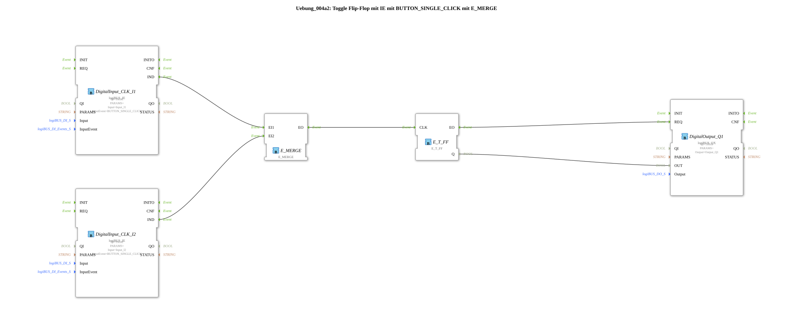

# Exercise_004a2: Toggle Flip-Flop with IE using BUTTON_SINGLE_CLICK with E_MERGE
[](https://notebooklm.google.com/notebook/a6872e59-1dfc-4132-a118-aff1bc7bc944)
This article describes the logiBUS® exercise `Uebung_004a2`. Here, the impulse circuit is extended so that it can be operated by two different pushbuttons. This is achieved by logically combining the events from the two pushbuttons.
----
## Objective of the Exercise
The objective is to learn how to combine asynchronous event streams. If two different event sources (pushbuttons) are to trigger the same process (switching the light), their signals must be merged before they reach the flip-flop component.

-----

## Description and Components

[cite_start]The subapplication `Uebung_004a2.SUB` uses a `E_MERGE` function block to route two input events to a common clock input[cite: 1].

### Function Blocks (FBs)



* **`DigitalInput_CLK_I1` & `I2`**: Two `logiBUS_IE` function blocks, configured to `BUTTON_SINGLE_CLICK`. [cite_start]They generate events when button 1 or 2 is pressed[cite: 1].
* **`E_MERGE`**: A standard event function block. [cite_start]It has two event inputs (`EI1`, `EI2`) and one event output (`EO`). Every incoming event is immediately passed to the output.[cite: 1]
* **`E_T_FF`**: The toggle flip-flop for storing the state.
* **`DigitalOutput_Q1`**: The hardware output for the lamp.

-----

## Functionality

The circuit provides a logical OR for the trigger:

```xml
<EventConnections>
<Connection Source="DigitalInput_CLK_I1.IND" Destination="E_MERGE.EI1"/>
<Connection Source="DigitalInput_CLK_I2.IND" Destination="E_MERGE.EI2"/>
<Connection Source="E_MERGE.EO" Destination="E_T_FF.CLK"/>
</EventConnections>

[cite_start][cite: 1]

1. When button 1 is pressed, `I1` sends an event to `E_MERGE.EI1`. `E_MERGE` forwards it to `EO` -> `E_T_FF` toggles.

2. When button 2 is pressed, `I2` sends an event to `E_MERGE.EI2`. `E_MERGE` forwards it to `EO` -> `E_T_FF` toggles.

The light toggles with each click, regardless of which button is pressed.

The light therefore changes with each click. -----

## Application Example

**Toggle switch in the hallway**: The light can be switched on at one end of the hallway and off at the other. Each button press simply toggles the light, regardless of its current state.
