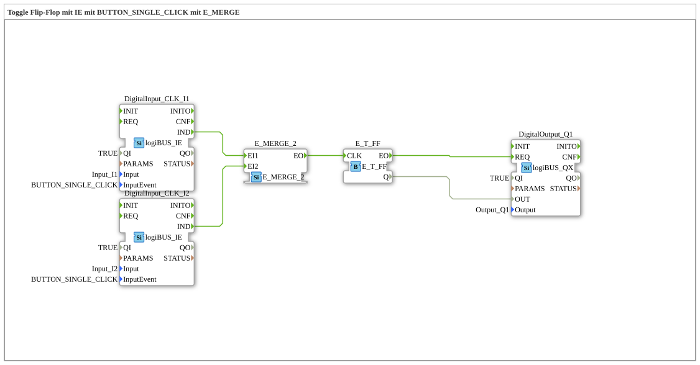

Here is the documentation for exercise `Uebung_004a2_2`, based on the provided data.
# Exercise_004a2_2: Toggle Flip-Flop with IE using BUTTON_SINGLE_CLICK with E_MERGE

* * * * * * * * * *
## Introduction

This exercise implements a circuit where an output (Q1) can be toggled by two different inputs (I1 and I2). It specifically responds to the "single click" event of the pushbuttons. The logic uses an event toggle flip-flop (`E_T_FF`) in combination with an event merge block (`E_MERGE_2`) to combine the signals from the two pushbuttons.

This corresponds to a classic two-way switching or impulse switching circuit in building automation, implemented using event logic in IEC 61499.

## Function Blocks (FBs) Used

In this sub-app, various function blocks are interconnected to implement the desired logic.

### Sub-Blocks:

#### DigitalInput_CLK_I1 & DigitalInput_CLK_I2

- **Type**: `logiBUS::io::DI::logiBUS_IE`
- **Description**: These blocks serve as an interface to the physical inputs. They are configured to generate events.
- **Configuration**:
- **Parameters**: `Input` = `Input_I1` (or `Input_I2`)
- **Parameters**: `InputEvent` = `BUTTON_SINGLE_CLICK`
- **Functionality**: This function block monitors the physical input. When a single click is detected, the `IND` event is triggered.

#### E_MERGE_2

- **Type**: `iec61499::events::E_MERGE_2`
- **Description**: A function block for merging event flows.
- **Event Inputs**: `EI1`, `EI2`
- **Event Output**: `EO`
- **Functionality**: This function block acts as an OR gate for events. Regardless of whether an event arrives at input `EI1` or input `EI2`, it is immediately forwarded to output `EO`.

#### E_T_FF

- **Type**: `iec61499::events::E_T_FF`
- **Description**: An event-driven toggle flip-flop.
- **Event Input**: `CLK`
- **Data Output**: `Q`
- **Event Output**: `EO`
- **Functionality**: Whenever an event arrives at the `CLK` input, the Boolean state of the output `Q` changes (from FALSE to TRUE or vice versa). After the state change, an event is triggered at the `EO` output.

#### DigitalOutput_Q1

- **Type**: `logiBUS::io::DQ::logiBUS_QX`
- **Description**: Interface to the physical output.
- **Configuration**:
- **Parameters**: `Output` = `Output_Q1`
- **Functionality**: This function block writes the value at input `OUT` to the physical output as soon as an event arrives at input `REQ`.

## Program Flow and Connections

The circuit flow is defined as follows:

1. **Input Detection**:
- The user presses either the button at input `Input_I1` or at input `Input_I2`.
- The corresponding function blocks (`DigitalInput_CLK_I1` or `DigitalInput_CLK_I2`) detect the "single click" and send a `IND` event.
2. **Merge**:
- The event from `I1` (connected to `E_MERGE_2.EI1`) or the event from `I2` (connected to `E_MERGE_2.EI2`) reaches the merge block.
- `E_MERGE_2` forwards the event to the flip-flop via `EO`.
3. **Toggle**:
- The event reaches the clock input `CLK` of `E_T_FF`.
- The flip-flop inverts its current state at the data output `Q`.
... * The flip-flop signals the new value via the event `EO`.

4. **Output**:
- The flip-flop's event `EO` activates the output block `DigitalOutput_Q1` at the input `REQ`.
- Simultaneously, the new state `Q` is transferred to `DigitalOutput_Q1.OUT`.
- The physical lamp/actuator at `Output_Q1` switches on or off.

## Summary

The exercise `Uebung_004a2_2` effectively demonstrates how to route multiple input signals to a common processing logic in 4diac. By using the `E_MERGE_2` block, both button 1 and button 2 can control the same `E_T_FF` (toggle flip-flop). This allows for flexible control of an output from multiple locations, similar to an impulse relay circuit in electrical engineering.

---

### 🌐 Related topic subpages on ms-muc-docs.de

- [🌐 Eclipse 4diac IDE & color reference on ms-muc-docs.de ](https://www.ms-muc-docs.de/iec-61499/eclipse-4diac/)

]
