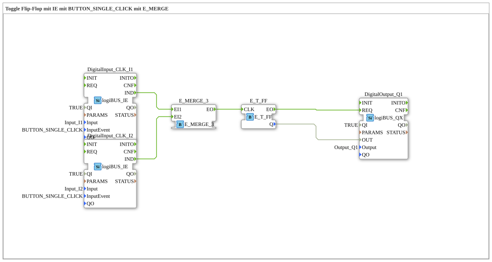

Here is the documentation for exercise `Uebung_004a2_3` based on the provided data.
# Exercise_004a2_3: Toggle Flip-Flop with IE using BUTTON_SINGLE_CLICK with E_MERGE

* * * * * * * * * *
## Introduction

This exercise implements a **pulse circuit** (toggle function) that can be controlled by two different inputs. The goal is to switch a digital output (e.g., a lamp) on and off by pressing one of two buttons.

This uses a toggle flip-flop (`E_T_FF`), which changes its state with each input pulse. The unique feature lies in the use of event input blocks (`logiBUS_IE`) that specifically respond to a "single click" (`BUTTON_SINGLE_CLICK`), as well as a merge block (`E_MERGE`) that combines the signals from the two buttons.

## Function Blocks (FBs) Used

This sub-application uses various blocks from the `logiBUS` and `iec61499` standard libraries to implement the logic.

### Sub-Blocks: DigitalInput_CLK_I1 & DigitalInput_CLK_I2

The input blocks detect the button presses.

- **Type**: `logiBUS::io::DI::logiBUS_IE`
- **Internal Function Blocks Used**:
- **DigitalInput_CLK_I1**:
- Parameters: `Input` = `Input_I1`
- Parameters: `InputEvent` = `BUTTON_SINGLE_CLICK`
- Event Output: `IND` (Indication - Signals the Click)
- **DigitalInput_CLK_I2**:
- Parameters: `Input` = `Input_I2`
- Parameters: `InputEvent` = `BUTTON_SINGLE_CLICK`
- Event Output: `IND`
- **Functionality**: These function blocks monitor the physical inputs I1 and I2. They are configured to generate an event at output `IND` with a single click (`BUTTON_SINGLE_CLICK`).

### Sub-function blocks: E_MERGE_3

Used to merge event streams.

- **Type**: `iec61499::events::E_MERGE_3`
- **Internal Function Blocks Used**:
- **E_MERGE_3**:
- Event Input: `EI1` (Connected to I1)
- Event Input: `EI2` (Connected to I2)
- Event Output: `EO`
- **Functionality**: The merge block functions as an OR gate for events. Regardless of whether the signal comes from button I1 or button I2, the event is passed through to output `EO`.

### Sub-Blocks: E_T_FF

The actual memory element of the circuit.

- **Type**: `iec61499::events::E_T_FF`
- **Internal Function Blocks Used**:
- **E_T_FF**:
- Event Input: `CLK` (Clock)
- Data Output: `Q` (Current Status: TRUE/FALSE)
- Event Output: `EO` (Event Output after State Change)
- **Functionality**: The toggle flip-flop changes its internal state `Q` (from 0 to 1 or from 1 to 0) upon each incoming event at the `CLK` input.

### Sub-Blocks: DigitalOutput_Q1

Establishes the connection to the physical hardware.

- **Type**: `logiBUS::io::DQ::logiBUS_QX`
- **Internal Function Blocks Used**:
- **DigitalOutput_Q1**:
- Parameters: `Output` = `Output_Q1`
- Data Input: `OUT` (Connected to T_FF.Q)
- Event Input: `REQ` (Request)
- **Functionality**: This function block writes the logical state to the physical output Q1.

## Program Flow and Connections

The circuit flow is as follows:

1. **Input Acquisition**: The user presses either a button connected to input `Input_I1` or input `Input_I2`. The function blocks `DigitalInput_CLK_I1` and `_I2` detect a single click (`BUTTON_SINGLE_CLICK`).
2. **Signal Event**: An event (`IND`) is sent by the activated input block.
3. **Merge**: The events from both inputs are connected to the function block `E_MERGE_3` (to `EI1` and `EI2`). As soon as one of the events arrives, the merge block immediately outputs an event at output `EO`.
... 4. **Toggle**: The combined event reaches the `CLK` input of the `E_T_FF`. This causes the flip-flop to invert (toggle) its state `Q`.

5. **Output**:
* The data signal `Q` (TRUE/FALSE) is sent to the data input `OUT` of the output block `DigitalOutput_Q1`.
* Simultaneously, the event output `EO` of the flip-flop triggers the `REQ` input of the output block to update the physical output.
*
## Summary

In the exercise `Uebung_004a2_3`, a classic push-button circuit with two operating points is implemented. Learning objectives include working with the `E_MERGE` function block for bundling event signals and using the `E_T_FF` (toggle flip-flop) for state storage. Furthermore, it is demonstrated how specific push-button events (here: single click) are processed in the LogiBUS library.
