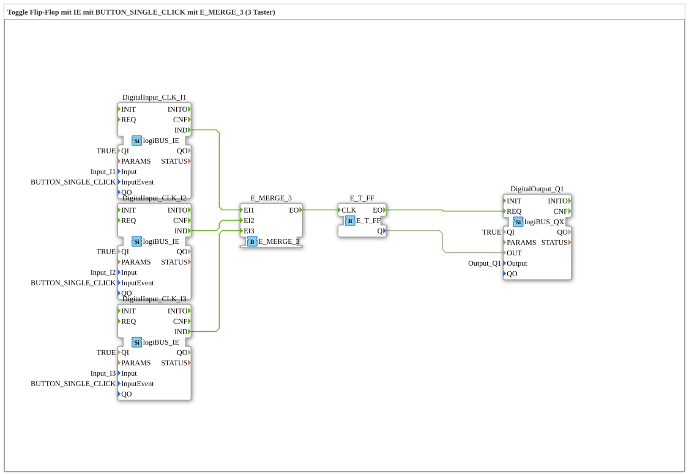

# Exercise_004a2_3b: Toggle Flip-Flop with IE using BUTTON_SINGLE_CLICK with E_MERGE_3 (3 Buttons)

* * * * * * * * * *

## Introduction

This exercise implements a **Toggle Flip-Flop** (also known as a **T-Flip-Flop**).

Pressing one of three buttons (I1, I2, or I3) toggles the connected output Q1 (turning it on/off).

The three buttons are combined using an **E_MERGE_3** block, so any button press triggers the flip-flop.

## Function Blocks Used

This exercise consists exclusively of primitive (predefined) function blocks. No custom sub-blocks (SubApps) are used.

### Primitive Function Blocks

- **DigitalInput_CLK_I1** (Type: `logiBUS::io::DI::logiBUS_IE`)

- Parameter settings:

- `QI` = `TRUE`

- `Input` = `Input_I1`

- `InputEvent` = `BUTTON_SINGLE_CLICK`

- Event output: `IND` (triggered on key press)

- Data output: not used (no data connection)

- **DigitalInput_CLK_I2** (Type: `logiBUS::io::DI::logiBUS_IE`)

- Parameter settings:

- `QI` = `TRUE`

- `Input` = `Input_I2`

- `InputEvent` = `BUTTON_SINGLE_CLICK`

- Event output: `IND`

- **DigitalInput_CLK_I3** (Type: `logiBUS::io::DI::logiBUS_IE`)

- Parameter settings:

- `QI` = `TRUE`

- `Input` = `Input_I3`

- `InputEvent` = `BUTTON_SINGLE_CLICK`

- Event output: `IND`

- **E_MERGE_3** (Type: `iec61499::events::E_MERGE_3`)

- Event inputs: `EI1`, `EI2`, `EI3`

- Event output: `EO` (triggered as soon as one of the input events arrives)

- **E_T_FF** (Type: `iec61499::events::E_T_FF`)

- Event input: `CLK` (clock – toggles on each incoming event)

- Event output: `EO` (triggered on each toggle) (triggered)

- Data output: `Q` (logical state, TRUE or FALSE)

- **DigitalOutput_Q1** (Type: `logiBUS::io::DQ::logiBUS_QX`)

- Parameter settings:

- `QI` = `TRUE`

- `Output` = `Output_Q1`

- Event input: `REQ` (request to set the output)

- Data input: `OUT` (value written to the real output)

## Program flow and connections

1. **Event chaining**

- The three push-button modules (`DigitalInput_CLK_I1`, `I2`, `I3`) generate an event at their output `IND` when a button is pressed (BUTTON_SINGLE_CLICK).

These three events are connected to the three inputs of `E_MERGE_3` (EI1 … EI3).

As soon as one of the three buttons is pressed, `E_MERGE_3` generates an event at its output `EO`.

This event is forwarded to the clock input `CLK` of `E_T_FF`.

- The `E_T_FF` toggles with each event: Its output `Q` switches between TRUE and FALSE. Simultaneously, the event `EO` of the flip-flop is triggered.

2. **Data Chaining**

- The state of the flip-flop (data output `Q`) is directly fed to the data input `OUT` of the output block `DigitalOutput_Q1`.

- The event `EO` of the flip-flop triggers the `REQ` input of the output block, so that the current value is written to the physical output **Output_Q1**.

3. **Summary of the Process**

- Each individual button press (on I1, I2, or I3) toggles the output.

- This allows the output to be controlled with three different buttons (toggle function).

## Summary

This exercise illustrates the **combination of event and data flows** in IEC 61499:

- Three equally valid buttons are combined into a common event via an **E_MERGE_3**.

- An **E_T_FF** (toggle flip-flop) implements the actual switching logic.

- The output component sets the physical output according to the flip-flop state.

**Learning Objectives:**

- Understanding the interaction of multiple event-driven inputs.

- Using a T flip-flop as a simple state memory.

- Practical application of logiBUS input and output modules with BUTTON_SINGLE_CLICK events.

**Difficulty level:** Beginner
**Prerequisites:** Basic knowledge of IEC 61499 event control.