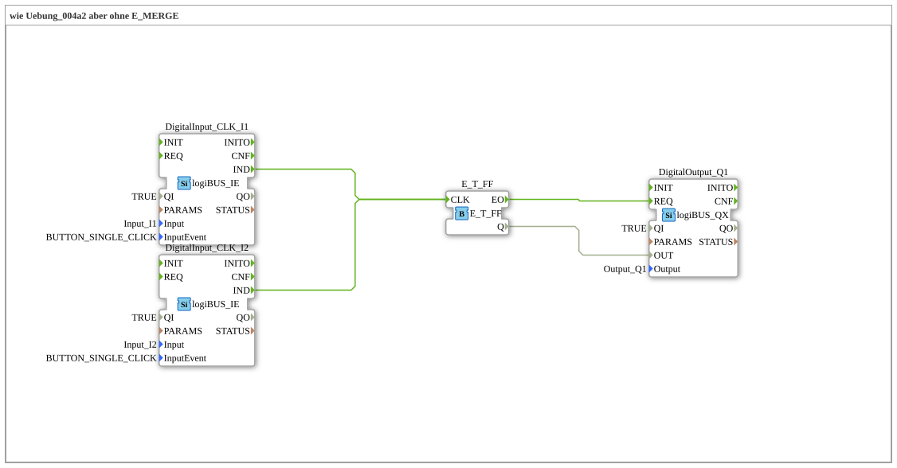

# Exercise_004a3: same as Exercise_004a2 but without E_MERGE

This article describes the logiBUS® exercise `Uebung_004a3`. This exercise demonstrates a simplification compared to `Uebung_004a2`: In IEC 61499, multiple event sources can often be directly connected to the same event input.
----
## Objective of the Exercise
The objective is to reduce the visual complexity of the network diagram. It demonstrates that the explicit `E_MERGE` block can be omitted because the 4diac runtime environment automatically processes incoming events on a port sequentially ("fan-in").

-----

## Description and Components

[cite_start]The subapplication `Uebung_004a3.SUB` connects two event sources directly to the clock input of the flip-flop[cite: 1].

### Function Blocks (FBs)

* **`DigitalInput_CLK_I1` & `I2`**: The event-based inputs.
* **`E_T_FF`**: The toggle flip-flop.
* **`DigitalOutput_Q1`**: The output.

The function block `E_MERGE` from the previous exercise is intentionally omitted here.

-----

## Functionality

<EventConnections>
<Connection Source="DigitalInput_CLK_I1.IND" Destination="E_T_FF.CLK"/>
<Connection Source="DigitalInput_CLK_I2.IND" Destination="E_T_FF.CLK"/>
</EventConnections>

[cite_start][cite: 1]

The functionality is identical to the exercise with `E_MERGE`: Every incoming event at `E_T_FF.CLK` – regardless of whether it originates from `I1` or `I2` – triggers the execution of the function block. 4diac natively supports this multiple connection for events.

> **Important Note:** This is **not permitted** for **data connections**! Two data outputs must never write directly to the same data input, as this would lead to conflicts. However, for events, this is an efficient method for "OR" logic of triggers.

-----

## Application Example

Same example as before (toggle switch), but with leaner code (fewer blocks, improved clarity).

---

### 🌐 Related topic subpages on ms-muc-docs.de
* [🌐 Eclipse 4diac IDE & Color Reference on ms-muc-docs.de](https://www.ms-muc-docs.de/iec-61499/eclipse-4diac/)

]
