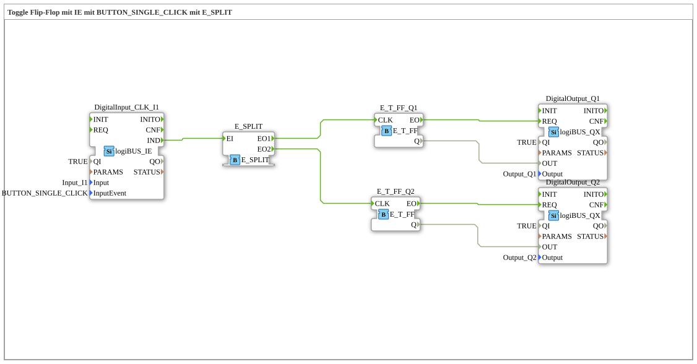

# Exercise_004a4: Toggle Flip-Flop with IE using BUTTON_SINGLE_CLICK with E_SPLIT
[](https://notebooklm.google.com/notebook/a6872e59-1dfc-4132-a118-aff1bc7bc944)
This article describes the logiBUS® exercise `Uebung_004a4`. It demonstrates how a single event can be used to sequentially trigger multiple independent processes using a `E_SPLIT` function block.
-----
## Objective of the Exercise
The objective is to understand sequential event processing. The `E_SPLIT` function block receives a single input event and then fires its outputs one after the other. This allows an action to be distributed across multiple targets while defining the order of execution.

-----

## Description and Components

[cite_start]The subapplication `Uebung_004a4.SUB` uses a push button to switch two separate toggle flip-flops simultaneously[cite: 1].

### Function Blocks (FBs)



* **`DigitalInput_CLK_I1`**: The event generator (click button).
* **`E_SPLIT`**: An event distributor. It has one input `EI` and two outputs `EO1` and `EO2`.
* **`E_T_FF_Q1` & `E_T_FF_Q2`**: Two independent flip-flops.
* **`DigitalOutput_Q1` & `DigitalOutput_Q2`**: Two physical outputs.

-----

## Functionality

```xml
<EventConnections>
<Connection Source="DigitalInput_CLK_I1.IND" Destination="E_SPLIT.EI"/>
<Connection Source="E_SPLIT.EO1" Destination="E_T_FF_Q1.CLK"/>
<Connection Source="E_SPLIT.EO2" Destination="E_T_FF_Q2.CLK"/>
</EventConnections>

[cite_start][cite: 1]

1. A click on button 1 sends an event to `E_SPLIT.EI`.

2. `E_SPLIT` then **first** sends an event to `EO1` ➡️ `E_T_FF_Q1` toggles.

3. Immediately afterward, `E_SPLIT` sends an event to `EO2` ➡️ `E_T_FF_Q2` toggles.

Both lamps change their state synchronously, controlled by a single button.

> **Note:** As noted in the source code, it would be functionally more efficient to connect both outputs to a single flip-flop. This exercise serves solely to demonstrate event distribution using `E_SPLIT`.

-----

## Application Example

**Central Off Circuit**: A "End of Work" button triggers several actions sequentially via a splitter: First, the work lights are switched off (`Q1`), and then the power supply to the machines is cut off (`Q2`).