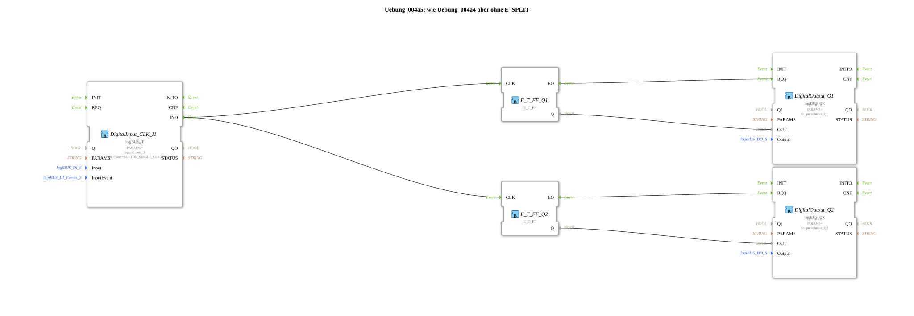

# Exercise_004a5: same as Exercise_004a4 but without E_SPLIT

[](https://notebooklm.google.com/notebook/a6872e59-1dfc-4132-a118-aff1bc7bc944)

This article describes the logiBUS® exercise `Uebung_004a5`. Similar to event merging, this exercise demonstrates that distributing an event to multiple destinations is often possible without an explicit function block.

----

## Objective of the Exercise

Demonstration of the "fan-out" capability of event connections in 4diac. A single event output can be connected to multiple event inputs to trigger parallel actions.


``` -----

## Description and Components

[cite_start]The subapplication `Uebung_004a5.SUB` removes the `E_SPLIT` block from the previous exercise and connects the button directly to both flip-flops[cite: 1].

### Function Blocks (FBs)



* **`DigitalInput_CLK_I1`**: Button.

* **`E_T_FF_Q1` & `Q2`**: Two independent flip-flops.

-----

## Functionality


```xml
<EventConnections>
    <Connection Source="DigitalInput_CLK_I1.IND" Destination="E_T_FF_Q1.CLK"/>
    <Connection Source="DigitalInput_CLK_I1.IND" Destination="E_T_FF_Q2.CLK"/>
</EventConnections>
```


[cite_start][cite: 1]

When `I1` fires an event, it is distributed to all connected targets. The processing order is not strictly defined in the IEC 61499 standard for this case (it usually occurs in the order in which the connections were established).

**When to use which?**

* Use **direct connections (fan-out)** when the processing order is irrelevant (as here when toggling two lamps simultaneously).

* Use a **`E_SPLIT` block** when an exact sequence (first A, then B) is technically essential.

-----

## Application Example

Same example as before (central off), but implemented in a more space-efficient way. This is the standard way in 4diac to duplicate signals.


* ---

### 🌐 Related topic subpages on ms-muc-docs.de

* [🌐 Eclipse 4diac IDE & Color Reference on ms-muc-docs.de](https://www.ms-muc-docs.de/iec-61499/eclipse-4diac/)


```