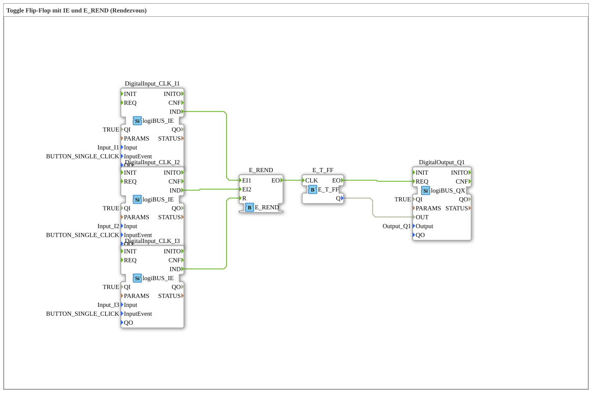

# Exercise_004a6: Toggle Flip-Flop with IE and E_REND (Rendezvous)
[](https://notebooklm.google.com/notebook/a6872e59-1dfc-4132-a118-aff1bc7bc944)
This article describes the logiBUS® exercise `Uebung_004a6`. It introduces an advanced event pattern: the rendezvous. An event is only passed on when several different conditions have occurred independently of each other.
----
## Objective of the Exercise


Learning how to use the `E_REND` function block. This functions like a "memory AND" for events. It only fires at the output when an event has been registered at *all* configured inputs at least once. This is used for the synchronization of asynchronous processes.

-----

## Description and Components

[cite_start]The subapplication `Uebung_004a6.SUB` uses `E_REND` to ensure that two buttons have been pressed before the output switches.[cite: 1]

### Function Blocks (FBs)
* **`DigitalInput_CLK_I1` & `I2`**: The two buttons for synchronization.
* **`DigitalInput_CLK_I3`**: A reset button for clearing the preconditions.
* **`E_REND`**: The rendezvous logic gate with inputs `EI1`, `EI2`, and a reset input `R`.
* **`E_T_FF`**: The flip-flop for state storage.

-----

## Functionality

The logic requires acknowledgment from both sources:

```xml
<EventConnections>
<Connection Source="DigitalInput_CLK_I1.IND" Destination="E_REND.EI1"/>
<Connection Source="DigitalInput_CLK_I2.IND" Destination="E_REND.EI2"/>
<Connection Source="E_REND.EO" Destination="E_T_FF.CLK"/>
<Connection Source="DigitalInput_CLK_I3.IND" Destination="E_REND.R"/>
</EventConnections>

[cite_start][cite: 1]

The functional sequence:

1. If only button 1 (`I1`) is pressed, nothing happens at the output. `E_REND` internally stores: "EI1 is complete".

2. If button 2 (`I2`) is pressed later, the condition is met (both were present). `E_REND` now triggers the event on `EO`.

3. The flip-flop toggles the output state.

4. After that, `E_REND` automatically resets and waits again for both inputs.

* The reset button (`I3`) can be used at any time to clear the internal markers of `E_REND` (aborting the sequence).

-----

## Application Example

**Sequential Release**:

In an assembly hall, an assembly worker must confirm the assembly (`I1`) and a quality control inspector must accept the inspection (`I2`). Only when both have given their confirmation (independently of each other and in any order) may the conveyor belt advance to the next step (`EO`).