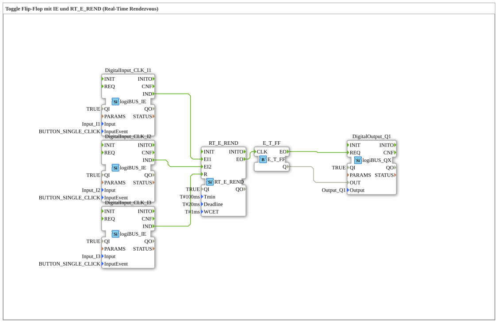

# Exercise_004a6a: Toggle Flip-Flop with IE and RT_E_REND (Real-Time Rendezvous)

* * * * * * * * * *

## Introduction

This exercise implements a toggle flip-flop controlled by real-time events. It serves to familiarize you with the interaction of digital inputs (IE), a real-time rendezvous function block (RT_E_REND), and a toggle flip-flop (E_T_FF). The output is provided on a digital output (QX). The goal is to deepen your understanding of time-controlled event chains in 4diac.

## Function Blocks Used (FBs)

### logiBUS_IE (DigitalInput_CLK_I1, DigitalInput_CLK_I2, DigitalInput_CLK_I3)

- **Type**: logiBUS::io::DI::logiBUS_IE
- **Parameters**:
- `QI` = `TRUE`
- `Input` = respective physical input (`Input_I1`, `Input_I2`, `Input_I3`)
- `InputEvent` = `BUTTON_SINGLE_CLICK`
- **Functionality**:

Detects a single click on a digital input and generates An event originating from the initial event `IND`. Serves as the starting point for the event chain.

An event originating from the initial event `IND`.

This event serves as the starting point for the event chain.

### RT_E_REND

- **Type**: eclipse4diac::rtevents::RT_E_REND
- **Parameters**:
- `QI` = `TRUE`
- `Tmin` = `T#100ms` (Minimum time between two triggers)
- `Deadline` = `T#20ms` (Maximum permissible response time)
- `WCET` = `T#1ms` (Worst-case execution time)
- **Event Inputs**:
- `EI1` – First start input (connected to DigitalInput_CLK_I1.IND)
- `EI2` – Second start input (connected to DigitalInput_CLK_I2.IND)
- `R` – Reset input (connected to DigitalInput_CLK_I3.IND)
- **Event output**:
- `EO` – Output event (connected to E_T_FF.CLK)
- **Functionality**:

Implements a real-time rendezvous. It waits for events at `EI1` and `EI2`. Only when both have arrived within the deadline (20ms) is an event generated at output `EO`. The input `R` resets the internal state. This ensures that the subsequent logic is only triggered by synchronous events.

### E_T_FF

- **Type**: iec61499::events::E_T_FF
- **No parameters**
- **Event input**:
- `CLK` – Clock input (connected to RT_E_REND.EO)
- **Data output**:
- `Q` – Output value (Bool, connected to DigitalOutput_Q1.OUT)
- **Functionality**:

Toggle flip-flop. The internal state is toggled on each event at the clock input (`CLK`). The output `Q` indicates the current state (TRUE/FALSE).

### logiBUS_QX (DigitalOutput_Q1)

- **Type**: logiBUS::io::DQ::logiBUS_QX
- **Parameters**:
- `QI` = `TRUE`
- `Output` = `Output_Q1` (physical output)
- **Event Input**:
- `REQ` – Request event (connected to E_T_FF.EO)
- **Data Input**:
- `OUT` – Output value (connected to E_T_FF.Q)
- **Functionality**:

Sets the physical digital output `Output_Q1` to the value that is connected to the data input The input `OUT` is present as soon as an event arrives at the `REQ` input.

## Program Flow and Connections

This exercise uses three digital inputs (`I1`, `I2`, `I3`) and one digital output (`Q1`).

1. **Event Chaining**:

- If a key press is detected at `I1`, `DigitalInput_CLK_I1` sends an event via `IND` to the event input `EI1` of `RT_E_REND`.
- When a key press is detected at `I2`, `DigitalInput_CLK_I2` sends an event via `IND` to the event input `EI2` of `RT_E_REND`.
- The reset input `R` of `RT_E_REND` is activated via `DigitalInput_CLK_I3` (key press at `I3`).
- If both events arrive at `EI1` and `EI2` within the deadline (20 ms), `RT_E_REND` generates an event at its `EO` output. This event is then sent to the `CLK` input of the flip-flop `E_T_FF`.
1. **Data Chaining**:

- The output `Q` of the flip-flop `E_T_FF` is passed via a data connection to the data input `OUT` of the output block `DigitalOutput_Q1`.

1. **State Change**:

- Each successful rendezvous (simultaneous pressing of `I1` and `I2` within 20 ms) toggles the output `Q1`.
- A key press on `I3` resets the rendezvous state (without directly changing the output).
- The output `Q1` changes its value with each rendezvous event.

**Learning Objectives**:

- Understanding of real-time rendezvous mechanisms in 4diac.
- Application of toggle flip-flops and output control.
- Creating event and data connections via SubApp networks.

**Difficulty Level**: Advanced
**Prerequisites**: Basic knowledge of event control in 4diac, working with digital inputs/outputs.

**Instructions for Execution**:

This exercise is performed on a target platform with logiBUS hardware. The three pushbuttons must be connected (Input_I1, Input_I2, Input_I3). Output_Q1 can, for example, control an LED. After the application starts, the flip-flop is reset (Q = FALSE).

## Summary

This exercise demonstrates how to implement a real-time critical rendezvous mechanism using the `RT_E_REND` function block. By combining digital inputs, a toggle flip-flop, and an output block, a simple yet practical control circuit is created in which an output only switches when two pushbuttons are pressed simultaneously within a short time interval. A third button resets the synchronization state. This exercise deepens your understanding of time-controlled event chains in IEC 61499.

---

### 🌐 Related topic subpages on ms-muc-docs.de

- [🌐 Eclipse 4diac IDE & color reference on ms-muc-docs.de](https://www.ms-muc-docs.de/iec-61499/eclipse-4diac/)

]
