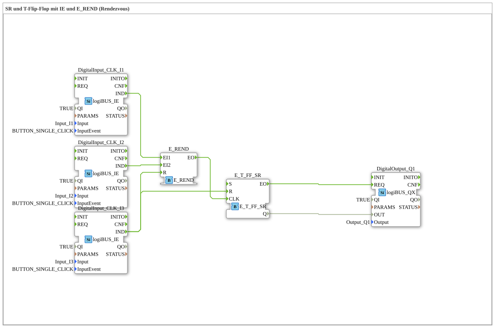

# Exercise_004a7: SR and T Flip-Flop with IE and E_REND (Rendezvous)

This article describes the logiBUS® exercise `Uebung_004a7`. Here, the rendezvous pattern is combined with an extended flip-flop type that has a dedicated reset function.
----
## Objective of the Exercise

Demonstration of the interaction between complex event logic (`E_REND`) and a flip-flop with set/reset priority (`E_T_FF_SR`). The goal is a controller that only becomes active after multiple confirmations but can be safely deactivated at any time.

-----

## Description and Components

[cite_start]The subapplication `Uebung_004a7.SUB` uses three pushbuttons to control a lamp state[cite: 1].

### Function Blocks (FBs)

* **`I1` & `I2`**: Inputs for rendezvous (arming).
* **`I3`**: Central reset input.
* **`E_REND`**: Synchronizes the events of `I1` and `I2`.
* **`E_T_FF_SR`**: A toggle flip-flop that also has a `R` (reset) input to set the state to `FALSE`.

-----

## Functionality

<EventConnections>
<Connection Source="DigitalInput_CLK_I1.IND" Destination="E_REND.EI1"/>
<Connection Source="DigitalInput_CLK_I2.IND" Destination="E_REND.EI2"/>
<Connection Source="E_REND.EO" Destination="E_T_FF.CLK"/>
<Connection Source="DigitalInput_CLK_I3.IND" Destination="E_REND.R"/>
<Connection Source="DigitalInput_CLK_I3.IND" Destination="E_T_FF.R"/>
</EventConnections>

[cite_start][cite: 1]

1. To toggle the light (`Q1`), both buttons `I1` and `I2` must be pressed. The rendezvous then fires the clock signal (`CLK`) for the flip-flop.
2. The button `I3` acts as an **all-off button**:
* It immediately resets the flip-flop `E_T_FF_SR` (output becomes `FALSE`).
* It simultaneously clears the memory of `E_REND`. Therefore, if only one button (`I1` or `I2`) was pressed, this partial information is deleted.

-----

## Application Example

**Machine Release with Emergency Stop**:

Two safety zones must be reported as "checked" (`I1` and `I2`) for the machine to switch to the next mode. However, an emergency stop button (`I3`) stops the machine immediately and invalidates all previous safety confirmations, so both zones must be checked again after the machine is released.
