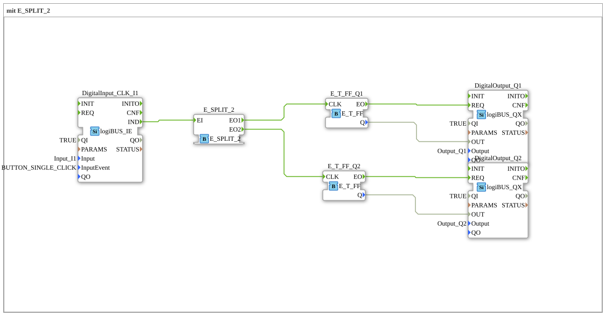

# Exercise_004a8: with E_SPLIT_2

This article describes the logiBUS® exercise `Uebung_004a8`. This is a variant of exercise 004a4, in which a specific function block is used for two outputs.

----

## Objective of the Exercise

To become familiar with type-specific splitter function blocks. While `E_SPLIT` is often generic, function blocks like `E_SPLIT_2` explicitly define the number of outputs.

-----

## Description and Components

[cite_start]The subapplication `Uebung_004a8.SUB` uses a `E_SPLIT_2` function block for event distribution[cite: 1].

### Function Blocks (FBs)

* **`DigitalInput_CLK_I1`**: Pushbutton.

* **`E_SPLIT_2`**: Distributes the input `EI` sequentially to `EO1` and `EO2`.

* **`E_T_FF_Q1` & `Q2`**: Two flip-flops.

-----

## Functionality

Functionally identical to Exercise 004a4: A single button press triggers two independent flip-flops sequentially. This ensures that both memory states are reliably updated.

-----

## Application Example

Synchronous switching of redundant systems where it must be ensured that both subsystems receive the same switching command in a fixed sequence.