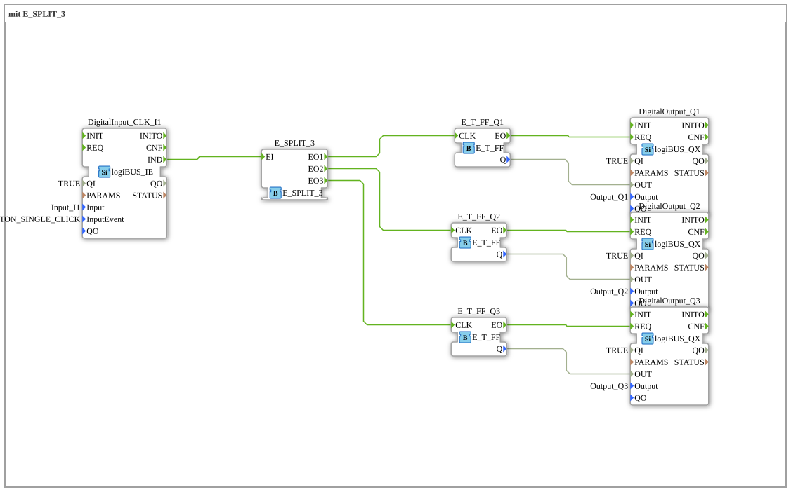

# Exercise_004a9: with E_SPLIT_3

This article describes the logiBUS® exercise `Uebung_004a9`. Here, the concept of sequential event splitting is extended to three objectives.
----
## Objective of the Exercise
Demonstrating the scalability of event distributors. With `E_SPLIT_3`, three processes can be triggered sequentially with a single trigger.

-----

## Description and Components

[cite_start]The subapplication `Uebung_004a9.SUB` distributes the signal from a button to three separate toggle flip-flops and thus to three outputs[cite: 1].

### Function Blocks (FBs)

* **`DigitalInput_CLK_I1`**: The central trigger (pushbutton).
* **`E_SPLIT_3`**: Distributes the input `EI` sequentially to `EO1`, `EO2`, and `EO3`.
* **`E_T_FF_Q1`, `Q2`, `Q3`**: Three independent flip-flops.
* **`DigitalOutput_Q1`, `Q2`, `Q3`**: Three physical lamps.

-----

## Functionality

A single click of the button triggers a defined sequence of events:

1. `EO1` fires ➡️ `Q1` toggles.

2. `EO2` fires ➡️ `Q2` toggles.

3. `EO3` fires ➡️ `Q3` toggles.

The processing in the control system is so fast that the lights switch on and off simultaneously for the viewer; however, the internal sequence is strictly defined.

-----

## Application Example

**Scene Control in a Building**: A button at the apartment door simultaneously switches the lighting in the hallway (`Q1`), the kitchen (`Q2`), and the outdoor area (`Q3`). The splitter ensures that all function blocks receive the trigger.