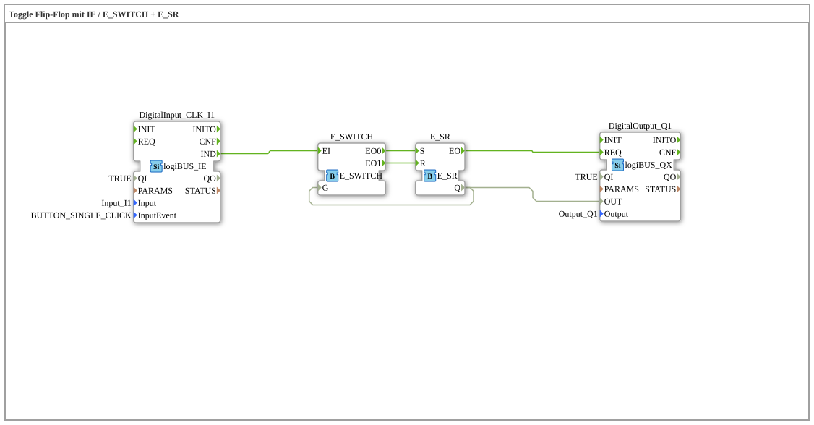

# Exercise_004b: Toggle Flip-Flop with IE / E_SWITCH + E_SR
[](https://notebooklm.google.com/notebook/a6872e59-1dfc-4132-a118-aff1bc7bc944)
This article describes the logiBUS® exercise `Uebung_004b`. It demonstrates how to manually construct the function of a toggle flip-flop from basic building blocks (switch and memory).
----
## Objective of the Exercise
Understanding the internal logic of a memory block. Instead of using the pre-built block `E_T_FF`, a feedback loop is constructed that uses the current state to direct the next event to the correct input (`Setzen` or `Rücksetzen`).

-----

## Description and Components

[cite_start]The subapplication `Uebung_004b.SUB` implements the toggle function by combining an event switch and a SR memory[cite: 1].

### Function Blocks (FBs)



* **`DigitalInput_CLK_I1`**: Returns an event with each key press.
* **`E_SWITCH`**: An event switch. [cite_start]Depending on the state of the data input `G`, it forwards the event `EI` either to `EO0` (if FALSE) or to `EO1` (if TRUE)[cite: 1].
* **`E_SR`**: An event-based SR (Set/Reset) memory.
* **`DigitalOutput_Q1`**: The hardware output.

----

## Functionality

The key lies in the feedback of the output state to the input of the switch:

```xml
<EventConnections>
<Connection Source="DigitalInput_CLK_I1.IND" Destination="E_SWITCH.EI"/>
<Connection Source="E_SWITCH.EO0" Destination="E_SR.S"/>
<Connection Source="E_SWITCH.EO1" Destination="E_SR.R"/>
<Connection Source="E_SR.EO" Destination="DigitalOutput_Q1.REQ"/>
</EventConnections>
<DataConnections>
<Connection Source="E_SR.Q" Destination="DigitalOutput_Q1.OUT"/>
<Connection Source="E_SR.Q" Destination="E_SWITCH.G"/>
</DataConnections>

[cite_start][cite: 1]

The functional sequence:

1. **OFF state**: `E_SR.Q` is FALSE, therefore `E_SWITCH.G` is also FALSE.

2. A key press fires `EI`. The switch forwards this to `EO0` ➡️ `E_SR.S`. The memory is set, and the lamp lights up.

3. **ON state**: Since the lamp is now on, `E_SWITCH.G` is TRUE.

4. The next key press fires `EI` again. This time, the switch routes the event to `EO1` ➡️ `E_SR.R`. The memory is reset, and the light goes out.

-----

## Evaluation

This setup is instructive for understanding the concepts of event-driven control and data feedback. However, in real-world projects, the specialized block `E_T_FF` should always be preferred, as it is clearer and consumes fewer resources.
