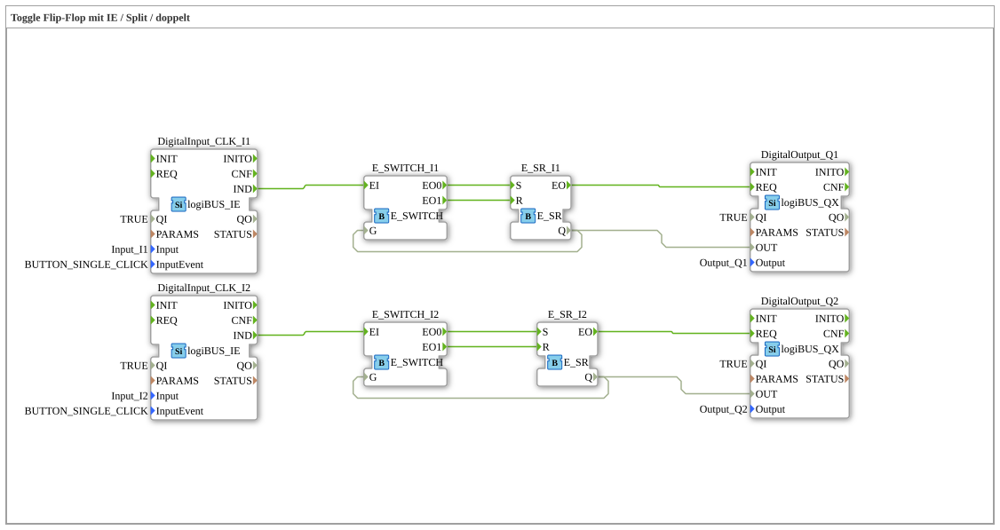

# Exercise_004b2: Toggle Flip-Flop with IE / Split / Dual

This article describes the logiBUS® exercise `Uebung_004b2`. Here, the manual toggle logic from exercise 004b is extended to two independent channels.
----
## Objective of the Exercise

To deepen the understanding of parallel, feedback logic structures. Each channel must correctly manage its own state to be independently switchable.

-----

## Description and Components

[cite_start]In `Uebung_004b2.SUB`, two identical logic strands (switch + memory) are built side by side [cite: 1].

### Function Blocks (FBs)

* **Channel 1**: Pushbutton `I1`, Switch `E_SWITCH_I1`, Memory `E_SR_I1`, Output `Q1`.
* **Channel 2**: Pushbutton `I2`, Switch `E_SWITCH_I2`, Memory `E_SR_I2`, Output `Q2`.

-----

## Functionality

The two channels operate on the same principle as in Exercise 004b: The initial state (`Q`) controls, via the gate input (`G`) of the switch, whether the next key press triggers a set or reset event.

<!-- Beispiel Kanal 1 -->
<Connection Source="DigitalInput_CLK_I1.IND" Destination="E_SWITCH_I1.EI"/>
<Connection Source="E_SWITCH_I1.EO0" Destination="E_SR_I1.S"/>
<Connection Source="E_SWITCH_I1.EO1" Destination="E_SR_I1.R"/>
<Connection Source="E_SR_I1.Q" Destination="E_SWITCH_I1.G"/>

Since there are no cross-connections between the strands, the operation of button 1 never affects the state of lamp 2 and vice versa.
