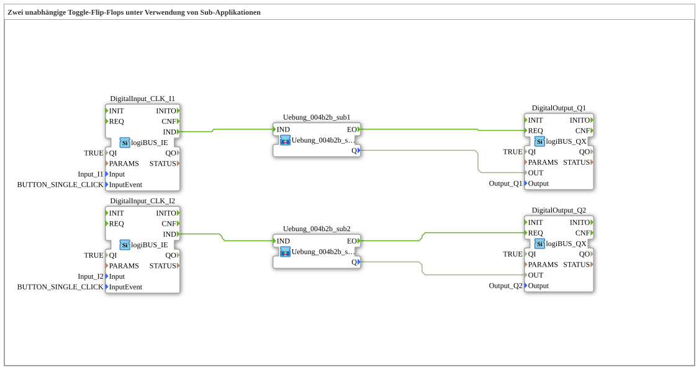

# Exercise_004b2b: Two Independent Toggle Flip-Flops Using Sub-Applications

* * * * * * * * * *
## Introduction

This exercise implements two independent toggle flip-flops.
The logic is encapsulated in a reusable sub-application, which is instantiated twice.

The input consists of two pushbuttons (single click), and the output consists of two digital outputs.

With each button press, the corresponding output toggles its state (on/off).

## Function Blocks (FBs) Used

### Main FBs at the Top Level

- **logiBUS_IE** – Event-Controlled Digital Input
- Parameters: `Input` = `Input_I1` or `Input_I2`, `InputEvent` = `BUTTON_SINGLE_CLICK`
- Receives an event as soon as the connected button is simply pressed.
- **logiBUS_QX** – Digital Output
- Parameters: `Output` = `Output_Q1` or `Output_Q2`
- Sets the physical output according to the applied data value (BOOL).

### Sub-Blocks: `Uebung_004b2b_sub`

- **Type**: SubAppType
- **Description**: Sub-application for a toggle flip-flop (consists of `E_SWITCH` and `E_SR`)

#### Internal Function Blocks Used

- **`E_SWITCH_I1`**: Type `E_SWITCH`
- Event Input: `EI`
- Event Outputs: `EO0` (when G=FALSE), `EO1` (when G=TRUE)
- Data Input: `G` (BOOL) – determines event forwarding
- **`E_SR_I1`**: Type `E_SR` (Set-Reset Flip-Flop)
- Event inputs: `S` (Set), `R` (Reset)
- Event output: `EO`
- Data output: `Q` (BOOL) – current state

#### Functionality

1. The sub-application receives an event at input `IND`.

`` 2. The internal `E_SWITCH` checks the value of its data input `G` (which is connected to the current output `Q` of `E_SR`):

If `Q = FALSE` (G=0), the event is forwarded to `EO0` and thus to the set input (`S`) of `E_SR`.

- If `Q = TRUE` (G=1), the event is forwarded to `EO1` and thus to the reset input (`R`) of `E_SR`.
3. `E_SR` then changes its state:
- On a set event, `Q = TRUE`.
- On a reset event, `Q = FALSE`.
4. After the state change, an event is generated at output `EO`, and the new value of `Q` is made available via the output of the sub-application.

`` This results in **toggle behavior**: Each incoming event changes the initial state.

## Program Flow and Connections

The main subapp `Uebung_004b2b` contains two completely independent channels – one each for digital input (`I1`/`I2`) and output (`Q1`/`Q2`).

**Connection per channel:**

logiBUS_IE (Taster) --> IND der Sub-Applikation
Sub-Applikation.EO --> REQ des logiBUS_QX
Sub-Applikation.Q   --> OUT des logiBUS_QX

- **Event Connections**:
- `DigitalInput_CLK_I1.IND` → `Uebung_004b2b_sub1.IND`
- `Uebung_004b2b_sub1.EO` → `DigitalOutput_Q1.REQ`
- (Analogous for the second channel with `I2` and `Q2`)
- **Data Connections**:
- `Uebung_004b2b_sub1.Q` → `DigitalOutput_Q1.OUT`
- (Analogous for the second channel)

This structure allows the sub-application's logic to be used twice without having to redefine it. The toggle function is executed with each key press (single click).

Uebung_004b2b_sub1.Q` → `DigitalOutput_Q1.OUT`
...
## Summary

- **Learning Objectives**:
- Design and use of sub-applications for logic reuse
- Implementation of a toggle flip-flop using `E_SWITCH` and `E_SR`
- Chaining of event-driven and data-driven connections
- Parameterization of low-level input/output blocks (logiBUS)
- **Difficulty Level**: Advanced Fundamentals
- **Prerequisites**: Working with events, Boolean logic, simple flip-flops

This exercise demonstrates how modular, reusable function blocks can be used efficiently in an industrial control environment (IEC 61499).
