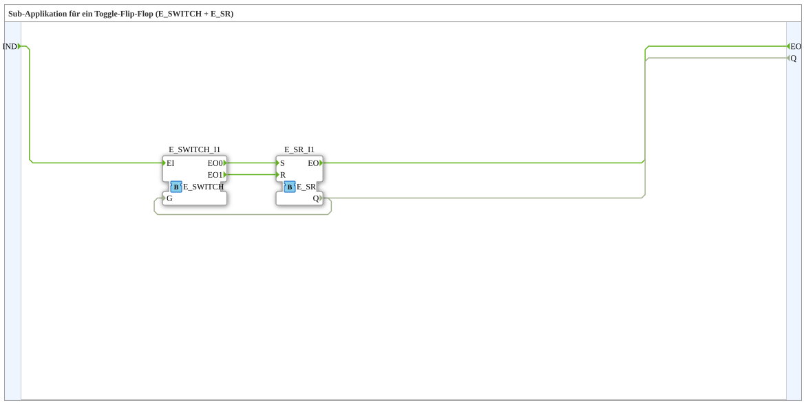

# Exercise_004b2b_sub: Sub-application for a Toggle Flip-Flop (E_SWITCH + E_SR)

* * * * * * * * * *
## Introduction
This exercise implements a **toggle flip-flop** (also known as a switching element) using the function blocks `E_SWITCH` and `E_SR`. The goal is to toggle the Boolean output `Q` on each incoming event `IND`. The implementation is a sub-application that can be integrated as a reusable component into higher-level applications.

## Function Blocks (FBs) Used

### Sub-Block: `Uebung_004b2b_sub`
- **Type**: SubAppType (Subapplication)
- **Internal FBs Used**:
- **E_SWITCH_I1**: `E_SWITCH`
- Parameters: None
- Event Input: `EI`
- Event Outputs: `EO0` (for `G=FALSE`), `EO1` (for `G=TRUE`)
- Data Input: `G` (BOOL)
- Data Output: None
- **E_SR_I1**: `E_SR`
- Parameters: None
- Event inputs: `S` (Set), `R` (Reset)
- Event output: `EO` (is output after Set/Reset)
- Data output: `Q` (BOOL, current state)
- **Functionality**:

The `E_SWITCH` forwards the input event `IND` to one of its two event outputs, depending on the value of the data input `G`:

- If `G = FALSE` is the input, the event is output to `EO0` (Set).

If `G = FALSE` is the input, the event is output to `EO0` (Set). - If `G = TRUE` is present, the event is passed to `EO1` (Reset).

E_SR` responds to events at its Set and Reset inputs:

- An event at `S` sets the output `Q = TRUE`.
- An event at `R` sets `Q = FALSE`.

The output `Q` is routed back to the gate input `G` of `E_SWITCH`. This causes the current state to be inverted with each new event `IND` – creating a **toggle flip-flop**. The output `Q` is simultaneously routed to the external output of the subapplication.

## Program Flow and Connections

1. **Initial State**: At startup, the output `Q` of `E_SR` is initially `FALSE` (default).

2. **First Event**: An event at the input `IND` reaches `E_SWITCH`. Since `G = FALSE` is present, the event is forwarded to the set input `S` of `E_SR`. `E_SR` sets `Q` to `TRUE` and outputs an event at `EO` (which is then forwarded to the outer output `EO` of the subapplication).

3. **Second event**: Now `G = TRUE` is present. The next `IND` event is therefore fed to the reset input `R`, which resets `Q` back to `FALSE`. This process repeats with each subsequent event.

The next `IND` event is therefore fed to the reset input `R`, which resets `Q` back to `FALSE`.

This process repeats with each subsequent event. **Connections at a Glance** (internal):

- Event Connections:

IND` → `E_SWITCH.EI`

E_SWITCH.EO0` → `E_SR.S`

E_SWITCH.EO1` → `E_SR.R`

E_SR.EO` → `EO` (external output)

- Data Connections:

E_SR.Q` → `E_SWITCH.G` (feedback)

E_SR.Q` → `Q` (external output)

**Learning Objectives**:

- Understanding the Toggle-Flip-Flop Behavior.
- Introduction to the function blocks `E_SWITCH` (event-driven multiplexer) and `E_SR` (set/reset memory).
- Creation and use of a subapplication in the 4diac IDE.

**Difficulty Level**: Easy

**Prerequisites**: Basic knowledge of event handling and Boolean logic in 4diac.

**Implementation**: The subapplication can be directly inserted into an application. The input `IND` toggles the state, and the output `Q` displays the current state.

## Summary

Exercise 004b2b demonstrates the simple implementation of a toggle flip-flop by combining the standard building blocks `E_SWITCH` and `E_SR`. The feedback of the output to the gate input of `E_SWITCH` creates the characteristic switching behavior. Implementing this as a sub-application allows for clean encapsulation and reuse in more complex control tasks.

---

### 🌐 Related topic subpages on ms-muc-docs.de
* [🌐 Eclipse 4diac IDE & color reference on ms-muc-docs.de ](https://www.ms-muc-docs.de/iec-61499/eclipse-4diac/)

]
