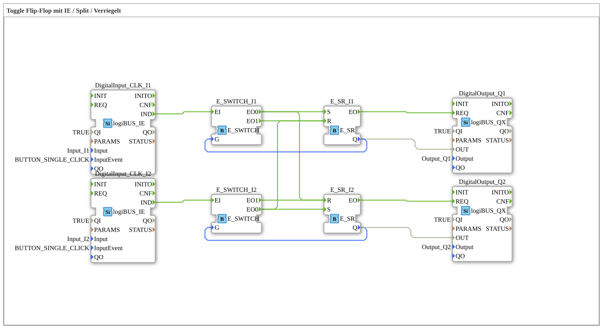

# Exercise_004b3: Toggle Flip-Flop with IE / Split / Interlock

This article describes the logiBUS® exercise `Uebung_004b3`. This exercise extends the two-channel system with mutual interlocking: Only one lamp can be illuminated at a time.
----
## Objective of the Exercise

Implementation of exclusive selection logic. Switching on one channel must necessarily result in the other channel being switched off. This is a standard requirement when selecting operating modes or directions of travel.

-----

## Description and Components

[cite_start]The sub-application `Uebung_004b3.SUB` is based on the structure of 004b2, but introduces additional event connections for interlocking[cite: 1].

### Function Blocks (FBs)

* Identical to 004b2: Pushbuttons `I1`/`I2`, Turnouts `E_SWITCH_I1`/`I2`, Memory `E_SR_I1`/`I2`.

-----

## Functionality

The special feature lies in the "cross-connection" of the set events:

<EventConnections>
<!-- Normale Toggle-Logik Kanal 1 -->
<Connection Source="E_SWITCH_I1.EO0" Destination="E_SR_I1.S"/>
<Connection Source="E_SWITCH_I1.EO1" Destination="E_SR_I1.R"/>

<!-- Verriegelung: Wenn Kanal 1 einschaltet (EO0), schalte Kanal 2 aus! -->
<Connection Source="E_SWITCH_I1.EO0" Destination="E_SR_I2.R"/>

<!-- Verriegelung: Wenn Kanal 2 einschaltet (EO0), schalte Kanal 1 aus! -->
<Connection Source="E_SWITCH_I2.EO0" Destination="E_SR_I1.R"/>
</EventConnections>

[cite_start][cite: 1]

The functional sequence:

1. Lamp 1 is on, lamp 2 is off.
2. User presses button 2 (`I2`).
3. The switch on channel 2 detects "lamp 2 is off" and triggers the on event (`EO0`).
4. This event is sent to the memory of channel 2 (`Setzen`) ➡️ Lamp 2 turns on.
5. Simultaneously, the same event is sent to the reset input of channel 1 ➡️ Lamp 1 immediately turns off.

Result: Activating one function automatically deactivates the other.

-----

## Application Example

**Operating Mode Selection**: A system can operate either in "Automatic" mode (`Q1`) or in "Manual" mode (`Q2`). As soon as the operator switches to manual mode, the automatic function must be stopped immediately for safety reasons.
