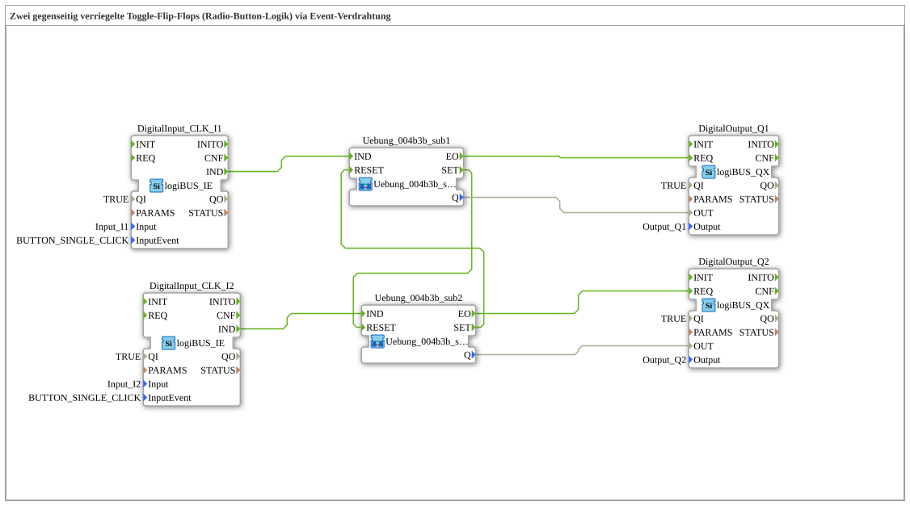

# Exercise_004b3b: Two Mutually Interlocked Toggle Flip-Flops (Radio Button Logic) via Event Wiring


* * * * * * * * * *
## Introduction
This exercise implements **radio button logic** – two toggle flip-flops that interlock each other.
The event wiring ensures that only one of the two outputs (`Q1` or `Q2`) can be active at any given time.

Pressing the corresponding input sets the appropriate flip-flop and simultaneously resets the other.

The logic is designed as a reusable sub-application and utilizes logiBUS inputs/outputs.

## Function Blocks (FBs) Used

### Sub-Blocks: `Uebung_004b3b_sub`

The main application uses two instances of this sub-block (`Uebung_004b3b_sub1` and `Uebung_004b3b_sub2`).

The sub-block is a **toggle flip-flop with an external RESET input and SET output for latching**.

- **Type**: Subapplication (custom type `Uebung_004b3b_sub`)
- **Interface**:
- Event inputs: `IND` (toggle pulse), `RESET` (external reset command)
- Event outputs: `EO` (output pulse after toggle), `SET` (signal to the other flip-flop to reset)
- Data output: `Q` (BOOL – current state)
- **Internal Function Blocks Used**:
- **E_SWITCH_I1**: `iec61499::events::E_SWITCH`
- Parameters: none
- Event input: `EI`
- Data input: `G` (BOOL)
- Event outputs: `EO0` (if `G = FALSE`), `EO1` (if `G = TRUE`)
- **Function**: Routes the incoming event pulse to either `EO0` or `EO1`, depending on the value of `G`.
- **E_SR_I1**: `iec61499::events::E_SR`
- Parameters: none
- Event inputs: `S` (Set), `R` (Reset)
- Event output: `EO` (triggered on every Set or Reset event)
- Data output: `Q` (BOOL – stored state)
- **Function**: Set-Reset Flip-Flop. Set to `S` (`Q = TRUE`) by an event, reset to `R` (`Q = FALSE`) by an event. The output `EO` signals a state change.
- **How the sub-function works**:
- An event on `IND` is passed through `E_SWITCH`.
- The current state `Q` of the flip-flop is passed to the switch as `G`.
- If `Q = FALSE` is present, the event is passed to `EO0` (set path) → sets `E_SR`.
- If `Q = TRUE` is present, the event is passed to `EO1` (reset path) → resets `E_SR` (toggle behavior).
- Simultaneously, the set event (from `EO0`) is also passed to the `SET` output to lock the other flip-flop.
- The external `RESET` input forces the flip-flop into the state `Q = FALSE`.
...`` If the event `Q = TRUE` is present, the event event is passed to the `EO1` output to the `E_SR` output to reset the other flip-flop.

```
## Program Flow and Connections

The main application (`Uebung_004b3b`) is wired as follows:

1. **Inputs**:

Two logiBUS digital inputs (`DigitalInput_CLK_I1` and `DigitalInput_CLK_I2`) are connected to the physical inputs `Input_I1` and `Input_I2`.

Both are configured to trigger the event `BUTTON_SINGLE_CLICK` – a key press triggers an event.

2. **Event Connection**:

- The event `IND` from `DigitalInput_CLK_I1` is routed to the sub-module `Uebung_004b3b_sub1.IND`.
- The event `IND` from `DigitalInput_CLK_I2` is routed to `Uebung_004b3b_sub2.IND`.
- The output `SET` from `sub1` is connected to the input `RESET` from `sub2`.
- The output `SET` from `sub2` is connected to the input `RESET` from `sub1`.
... *This creates a mutual interlock: As soon as one flip-flop is set, the other is reset.*

3. **Outputs**:

- The `Q` output of `sub1` is passed to the logiBUS digital output `DigitalOutput_Q1` (`Output_Q1`).
- The `Q` output of `sub2` is passed to `DigitalOutput_Q2` (`Output_Q2`).
- The output pulses (`EO`) of the sub-modules trigger the corresponding output modules via the `REQ` inputs.

**Example Flowchart**:

- Pressing the button on `I1` toggles `sub1`: If `Q1` is off, it is turned on; the `SET` output resets `sub2`.
- If `Q1` is already on, it is turned off without affecting the other module.
- Pressing a button on `I2` behaves analogously.

**Learning Objectives**:

- Understanding event wiring in IEC 61499
- Constructing a mutual interlock (radio button)
- Using toggle flip-flops with external reset
- Working with logiBUS input/output blocks

**Difficulty Level**: Medium
**Prerequisites**: Fundamentals of event-driven logic, familiarity with 4diac IDE and logiBUS.

## Summary

Exercise `Uebung_004b3b` demonstrates an elegant implementation of radio button logic using two interlocked toggle flip-flops.

The core idea is to cross-connect the `SET` outputs of the sub-blocks to the `RESET` inputs, so that only one output can be active at a time.

Thanks to the modular sub-application, the logic can easily be extended to multiple channels.

---

### 🌐 Related topic subpages on ms-muc-docs.de
* [🌐 Eclipse 4diac IDE & Color Reference on ms-muc-docs.de](https://www.ms-muc-docs.de/iec-61499/eclipse-4diac/)

]
