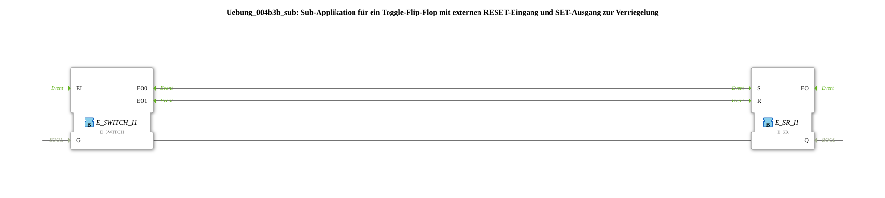

# Exercise_004b3b_sub: Sub-application for a toggle flip-flop with an external RESET input and a SET output for latching

* * * * * * * * * *
## Introduction
This sub-application implements a toggle flip-flop with an external RESET input and a SET output for latching. It serves as a reusable component for applications where an output state is toggled with each event and can be reset as needed.

## Function Blocks (FBs) Used

The sub-application contains two function blocks:

### E_SWITCH (IEC 61499 Event Switch)
- **Type**: `iec61499::events::E_SWITCH`
- **Internal FBs Used** (no other sub-blocks present)
- **Event Inputs**: `EI` (Event Input)
- **Event Outputs**: `EO0` (if input condition `G` = TRUE), `EO1` (if `G` = FALSE)
- **Data Input**: `G` (BOOL – Control Signal)
- **Functionality**: The This function block forwards an incoming event to `EO0` if the data value `G` is TRUE; otherwise, it forwards it to `EO1`. It functions as a conditional event gateway.

### E_SR (IEC 61499 Set-Reset Flip-Flop)

- **Type**: `iec61499::events::E_SR`
- **Internal Function Blocks Used** (no further sub-blocks present)
- **Event Inputs**: `S` (Set), `R` (Reset)
- **Event Output**: `EO` (triggered on every state change)
- **Data Output**: `Q` (BOOL – current state)
- **Parameters** (Default): none explicitly set
- **Functionality**: The function block sets the output `Q` to TRUE when an event occurs at the input `S`; It sets `Q` to FALSE when an event arrives at input `R`. A simultaneous event at `S` and `R` takes precedence: `S` has a higher priority.

## Program Flow and Connections

The sub-application has two event inputs (`IND` and `RESET`), two event outputs (`EO` and `SET`), and one data output (`Q`).

`` **Event Connections**:

- The input `IND` is connected to the event input `EI` of `E_SWITCH`.
- The output `EO0` of `E_SWITCH` leads to the set input `S` of `E_SR` and simultaneously to the sub-application output `SET`.
- The output `EO1` of `E_SWITCH` is connected to the reset input `R` of `E_SR`.

`` - The event output `EO` of `E_SR` is directly forwarded to the sub-application output `EO`.

- The sub-application input `RESET` is also connected to the reset input `R` of `E_SR`.

**Data Connections**:

- The output `Q` of `E_SR` is connected to the control input `G` of `E_SWITCH`.

**Data Connections**:

- The output `Q` of `E_SR` is connected to the control input `G` of `E_SWITCH`.

**Data Connections**:** - The output `Q` of `E_SR` is also routed as the sub-application output `Q`.

**Process**:

1. An event at input `IND` initiates processing.

**Process**:

**Process**: An event at input `IND` starts the processing.

**Process**: 2. The `E_SWITCH` checks the current state of `Q` (via the control signal `G`):

- If `Q` = FALSE, the event is passed on to `EO0`, setting `E_SR` (Q becomes TRUE) and simultaneously activating the output `SET`.
- If `Q` = TRUE, the event is passed on to `EO1`, resetting `E_SR` (Q becomes FALSE).

3. After each state change of `E_SR`, an event is output to `EO`.

4. An external event at input `RESET` forces the reset of `E_SR` (regardless of its current state) and also triggers an event at `EO`.

This allows the sub-application to implement a toggle function: Each event at `IND` toggles the output `Q`. The output `SET` is activated when it changes from FALSE to TRUE and can be used for interlocking (e.g., setting another function block). The input `RESET` resets the state without affecting the toggle cycle.

## Summary

In this exercise, a sub-application was created to implement a toggle flip-flop with a reset capability. Its functionality is based on the standardized IEC 61499 function blocks `E_SWITCH` and `E_SR`. Linking the event and data connections enables clean feedback of the current state and targeted output of a set pulse. The function block can serve as the basis for cycle controllers, counters, or simple state machines.

---

### 🌐 Related topic subpages on ms-muc-docs.de
* [🌐 IEC 61499 Events – The Pulse of Automation on ms-muc-docs.de ](https://www.ms-muc-docs.de/iec-61499/events/event/)

]
