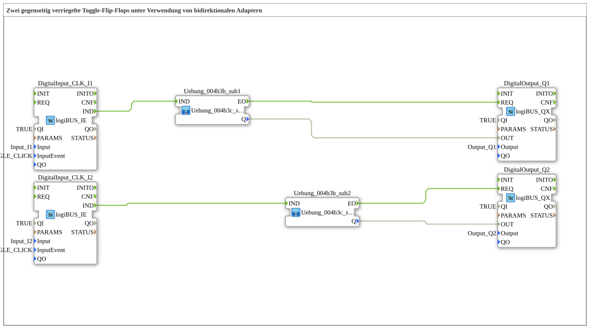

# Exercise_004b3c: Two Interlocked Toggle Flip-Flops Using Bidirectional Adapters

(No illustration is included with this exercise.)

* * * * * * * * * *
## Introduction

This exercise involves implementing a circuit consisting of two interlocked toggle flip-flops. Each flip-flop is toggled by its own push button (input I1 or I2). The key feature is the interlocking: only one of the two flip-flops can assume the logic state `TRUE` at any given time. As soon as one flip-flop is set to `TRUE`, it automatically resets the other. Communication between the two sub-applications is handled by a single bidirectional adapter (type AE2), resulting in a very compact interconnect structure.

This exercise demonstrates the use of bidirectional adapters for signal transmission between sub-applications and the coupling of event and data flows in an interlocked controller.

## Function Blocks Used

The following function blocks are used at the top level of the sub-application `Uebung_004b3c`:

- **DigitalInput_CLK_I1** (Type: `logiBUS::io::DI::logiBUS_IE`)
- Input: `Input_I1`
- Event: `BUTTON_SINGLE_CLICK`
- Outputs an event to `IND` when a key is pressed.
- **DigitalInput_CLK_I2** (Type: `logiBUS::io::DI::logiBUS_IE`)
- Input: `Input_I2`
- Event: `BUTTON_SINGLE_CLICK`
- **DigitalOutput_Q1** (Type: `logiBUS::io::DQ::logiBUS_QX`)
- Output: `Output_Q1`
- Switches the physical output Q1.
- **DigitalOutput_Q2** (Type: `logiBUS::io::DQ::logiBUS_QX`)
- Output: `Output_Q2`
- **Exercise_004b3b_sub1** (Type: `Uebungen::Uebung_004b3c_sub`)
- First instance of the latching toggle flip-flop.
- **Exercise_004b3b_sub2** (Type: `Uebungen::Uebung_004b3c_sub`)
- Second instance of the lockable toggle flip-flop.

### Sub-components: `Uebung_004b3c_sub`

This sub-application implements a lockable toggle flip-flop with a bidirectional adapter interface (AE2).

- **Type**: SubApp
- **Internal Function Blocks Used**:
- **E_SWITCH_I1** (Type: `iec61499::events::E_SWITCH`)
- Event Input: `EI`
- Data Input: `G` (Gate)
- Event Outputs: `EO0` (when G=FALSE), `EO1` (when G=TRUE)
- Function: Routes the incoming event to either `EO0` or `EO1`, depending on the value of `G`.

- **E_SR_I1** (Type: `iec61499::events::E_SR`)

- Event inputs: `S` (Set), `R` (Reset)
- Event output: `EO` (after a change in output Q)
- Data output: `Q` (BOOL)
- Function: Set-Reset flip-flop. On a Set event, `Q = TRUE` is output; on a Reset event, `Q = FALSE` is output.
- **AE2_EVENT_TO_E** (Type: `adapter::conversion::bidirectional::AE2_EVENT_TO_E`)
- Converts an event received via the adapter into a standard event signal.
- **AE2_E_TO_EVENT** (Type: `adapter::conversion::bidirectional::AE2_E_TO_EVENT`)
- Converts a normal event signal into an event that is sent via the adapter.
- **Functionality**:

The internal toggle mechanism is implemented by the set-reset flip-flop `E_SR`. When an event arrives at input `IND`, `E_SWITCH` determines, based on the current state `Q` (which is fed back to `G`), whether to set or reset:

- If `Q = FALSE` → event via `EO0` to the set input `S` → flip-flop is set.
- If `Q = TRUE` → event via `EO1` to the reset input `R` → flip-flop is reset.

In parallel, during a set operation (EO0), an event is sent via the adapter (`AE2_E_TO_EVENT`) to the other sub-application to trigger a reset. The event received via the adapter from the other side (`AE2_EVENT_TO_E`) is also routed to the reset input. This ensures that only one of the two flip-flops is `TRUE` at any given time.

The output `Q` is passed to the external system via the data output of the sub-application.

## Program Flow and Connections

The external wiring of the main sub-application is structured as follows:

- The event outputs of the two digital inputs (`DigitalInput_CLK_I1.IND` and `DigitalInput_CLK_I2.IND`) are directly connected to the event inputs `IND` of the two sub-applications.
- The data outputs `Q` of the sub-applications are routed to the digital output modules `DigitalOutput_Q1` and `DigitalOutput_Q2`.
- The bidirectional adapter connects **Uebung_004b3b_sub1.PLUG** to **Uebung_004b3b_sub2.SOCKET**. This single connection is sufficient to implement mutual interlocking: Whenever one sub-application is set, it sends a reset signal to the other via the adapter.

**Learning Objectives of the Exercise:**

- Understanding the use of bidirectional adapters for coupling sub-applications.
- Implementation of an interlocked toggle flip-flop structure.
- Interaction of event and data flows in IEC 61499.
- Practical experience with hardware inputs/outputs (logiBUS).

**Starting the Exercise:**

The exercise can be opened directly in the 4diac IDE and transferred to the target hardware (e.g., logiBUS). A prerequisite is correct configuration of the input and output addresses according to the hardware.

## Summary

In this exercise, a mutually interlocked control system using two toggle flip-flops was implemented. Interlocking is achieved via a single bidirectional adapter that transmits the reset signals between the two sub-applications. This exercise demonstrates how adapters can be used for efficient communication between sub-applications and reinforces the understanding of event control, state storage, and interlock logic in the IEC 61499 model.

---

### 🌐 Related topic subpages on ms-muc-docs.de

* [🌐 Eclipse 4diac IDE & color reference on ms-muc-docs.de](https://www.ms-muc-docs.de/iec-61499/eclipse-4diac/)

]
