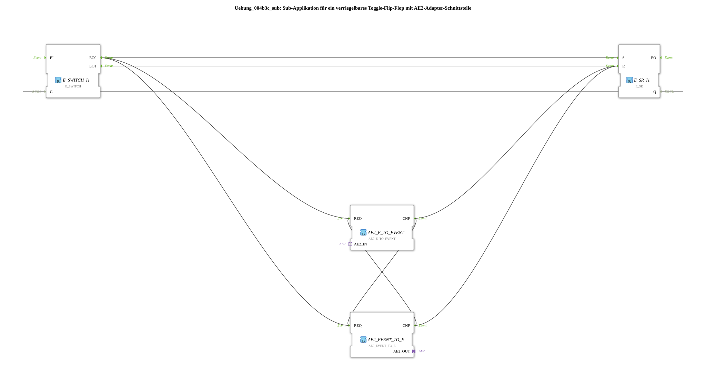

# Exercise_004b3c_sub: Sub-application for a lockable toggle flip-flop with an AE2 adapter interface

*Image of the exercise not available*
* * * * * * * * * *
## Introduction
This exercise implements a **sub-application for a lockable toggle flip-flop with an AE2 adapter interface**.

The flip-flop can be toggled via an event `IND`, with the current state being output at `Q`.

The bidirectional AE2 adapters (plug and socket) allow the behavior of external components to be influenced or read.

## Function Blocks Used

The sub-application consists of four internal function blocks:

- **E_SR_I1** (Type: `iec61499::events::E_SR`)
- **E_SWITCH_I1** (Type: `iec61499::events::E_SWITCH`)
- **AE2_EVENT_TO_E** (Type: `adapter::conversion::bidirectional::AE2_EVENT_TO_E`)
- **AE2_E_TO_EVENT** (Type: `adapter::conversion::bidirectional::AE2_E_TO_EVENT`)

No other sub-applications or sub-blocks are included.

### Function Block Details

#### E_SR_I1 (Set-Reset Flip-Flop)
- **Type**: `iec61499::events::E_SR`
- **Parameters**: None set
- **Event Inputs**: `S` (Set), `R` (Reset)
- **Event Outputs**: `EO` (Event after state change)
- **Data Output**: `Q` (Current state, BOOL)
- **Functionality**:

The E_SR stores a Boolean state. An event at input `S` sets `Q = TRUE`, an event at input `R` sets `Q = FALSE`. An event is output at output `EO` after each change.

An event is output at input `EO`. #### E_SWITCH_I1 (Event Switch)
- **Type**: `iec61499::events::E_SWITCH`
- **Parameters**: None set
- **Event Inputs**: `EI` (Input Event)
- **Data Input**: `G` (Control Signal, BOOL)
- **Event Outputs**: `EO0` (triggered when `G = FALSE`), `EO1` (triggered when `G = TRUE`)
- **Functionality**:

An event at input `EI` is either... depending on the value of input `G`... forwarded to `EO0` (for `G = FALSE`) or to `EO1` (for `G = TRUE`).

``` #### AE2_EVENT_TO_E (Adapter: AE2 event → 4diac event)
- **Type**: `adapter::conversion::bidirectional::AE2_EVENT_TO_E`
- **Parameters**: None set
- **Event inputs**: `REQ` (Conversion request)
- **Adapter input**: `AE2_IN` (of type AE2 – bidirectional)
- **Adapter output**: `AE2_OUT`
- **Data output**: No dedicated data output (the converted event is passed on internally)
- **Functionality**:

Converts an incoming AE2 adapter event (from the socket) into an internal 4diac event. The `REQ` input must be activated for this to work; after successful conversion, a `CNF` event will be output.

``` #### AE2_E_TO_EVENT (Adapter: 4diac event → AE2 event)
- **Type**: `adapter::conversion::bidirectional::AE2_E_TO_EVENT`
- **Parameters**: None set
- **Event inputs**: `REQ` (Request for conversion)
- **Adapter input**: `AE2_IN` (Bidirectional to socket/plug)
- **Adapter output**: `AE2_OUT`
- **Data output**: No dedicated data output
- **Functionality**:

Converts an internal 4diac event (triggered by `REQ`) into an AE2 adapter event, which is then sent to the adapter via the adapter output `AE2_OUT`. A plug is sent. Upon completion, a `CNF` event is output.

## Program Flow and Connections

The sub-application implements a **lockable toggle function** with the following sequence:

1. **Input event `IND`** reaches the function block `E_SWITCH_I1` at the event input `EI`.

2. The control input `G` of the switch is fed by the current state `Q` of `E_SR`.

- If `Q = FALSE` is off, the event is routed via `EO0` to the `S` input of `E_SR` → `Q` is set (toggle off → on).
- If `Q = TRUE` is on, the event is routed via `EO1` to the `R` input of `E_SR` → `Q` is reset (toggle on → off).

If `Q = TRUE` is on, the event is routed via `EO1` to the `R` input of `E_SR` → `Q` is reset (toggle on → off). 3. After each state change, `E_SR` sends an event to `EO` (output of the sub-app) and updates `Q`.

4. **Locking via the AE2 adapter**:

In addition to the direct connections, the adapter converters are controlled:

- Each event from `E_SWITCH.EO0` simultaneously triggers `AE2_EVENT_TO_E` and `AE2_E_TO_EVENT` (via the event connections shown).
- The two converters are cross-connected, so an event is forwarded from one to the other (see EventConnections in the network).
- This allows an external adapter (e.g., another system) to influence or monitor the toggle behavior.
- The specific effect depends on which devices or logic are connected via the plug (output) or socket (input).

**Learning Objectives:**

- Understanding discrete state machines (set-reset flip-flops) and their event control.
- Using adapter converters for communication between 4diac and external systems (AE2).
- Locking a toggle operation by combining E_SWITCH and feedback.

**Prerequisites:**

- Basic knowledge of the 4diac IDE, event/data flows, and the AE2 protocol.

**Starting the Exercise:**

- The sub-application can be integrated into a 4diac project and tested with a suitable application (with an IND event source and Q evaluation).

## Summary

Exercise **Exercise_004b3c_sub** demonstrates the construction of a latching toggle flip-flop using standard function blocks (E_SR, E_SWITCH) and bidirectional AE2 adapter converters.

The circuit toggles the output `Q` on each incoming event `IND` and simultaneously allows external control via the AE2 interface.

It is suitable as a basic building block for more complex control systems that require a changing signal with feedback to a higher-level system.

---

### 🌐 Related topic subpages on ms-muc-docs.de
* [🌐 Eclipse 4diac IDE & color reference on ms-muc-docs.de](https://www.ms-muc-docs.de/iec-61499/eclipse-4diac/)

]