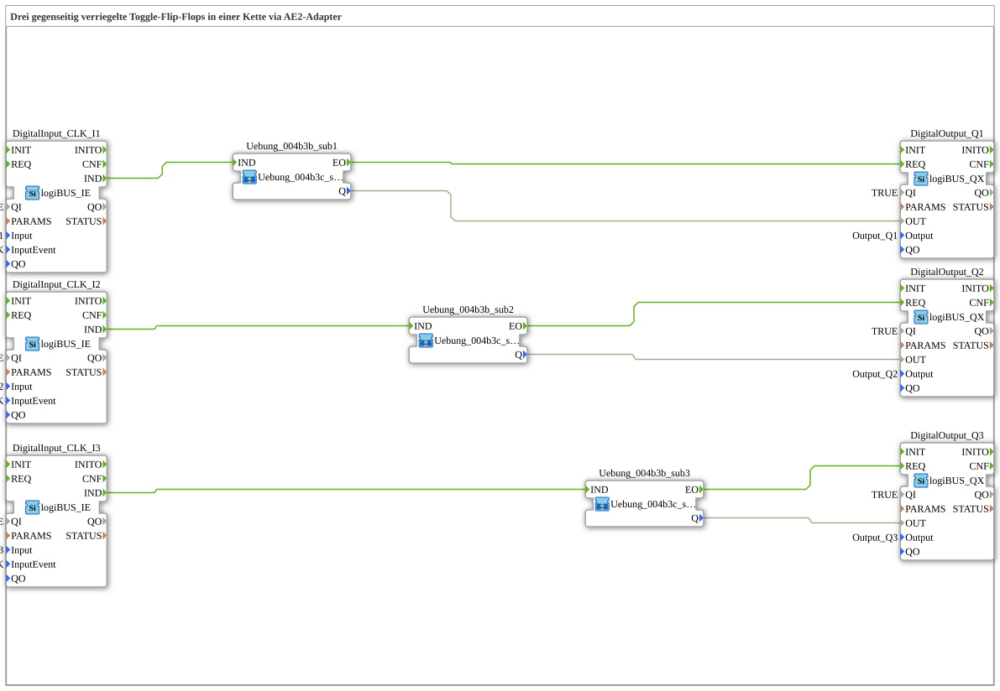

# Exercise_004b4c: Three Mutually Interlocked Toggle Flip-Flops in a Chain via AE2 Adapter

* * * * * * * * * *
## Introduction

This exercise demonstrates a chain of three mutually interlocked toggle flip-flops. Each flip-flop is toggled by its own single-click button. The interlocking ensures that only one output is active at any given time – similar to a ring counter with mutual locking. The connection between the individual stages is made via a bidirectional AE2 adapter, so that only a single connection per link is sufficient for all communication.
The hardware consists of three digital inputs (I1, I2, I3) and three digital outputs (Q1, Q2, Q3). The active output can be advanced by repeatedly pressing a button.

## Function Blocks Used (FBs)

- **logiBUS::io::DI::logiBUS_IE**: Digital input with event triggering.
- Parameters: QI = TRUE (input active), Input = corresponding hardware input (Input_I1, _I2, _I3), InputEvent = BUTTON_SINGLE_CLICK.
- **logiBUS::io::DQ::logiBUS_QX**: Digital output.
- Parameters: QI = TRUE (output active), Output = corresponding hardware output (Output_Q1, _Q2, _Q3).
- **SubApp Uebung_004b3c_sub** (instantiated three times here): Core block of the exercise. It implements a toggle flip-flop with mutual interlocking.

### Sub-Blocks: Exercise_004b3c_sub

- **Type**: SubApp (`Uebungen::Uebung_004b3c_sub`)
- **Internal Structure** (assumed, based on the task description):
- **Internal Function Blocks Used** (not visible in the XML, but conceptually relevant):
- A **Toggle Flip-Flop** (e.g., an SR or JK flip-flop) that changes its state with each event at input `IND`.
- A **Locking Logic Block** that evaluates the outputs of adjacent stages via the adapter (SOCKET/PLUG) and resets its own flip-flop when another stage is active.
- **Functionality**:
- The module has an event input `IND` and a data input (presumably for interlocking via the adapter).
- Upon a positive event (`IND`), the internal state is toggled. Simultaneously, the state of the adjacent stage is queried via the adapter. The module's own output `Q` may only be set to TRUE if no other stage is active; otherwise, it is reset and passes the state to the next stage.
- The adapter (plug/socket) serves as a bidirectional interface, allowing the state of both the preceding and subsequent stages to be transmitted.

## Program Flow and Connections

The three modules are connected in series:

- **Event Connections**:
- Each button (`DigitalInput_CLK_I1`, `_I2`, `_I3`) triggers an event (`IND`) when pressed, which is forwarded directly to the corresponding sub-app (`Uebung_004b3b_sub1`, `_sub3`).
- The output of the sub-app (`EO`) triggers the associated digital output module (`DigitalOutput_Q1`, etc.) via its event input (`REQ`).

- **Data Connections**:

- The output value `Q` of each subapp is directly connected to the data output `OUT` of the corresponding `logiBUS_QX`, so that the hardware output displays the current state.
- **Adapter Connections (Chain)**:
- `Uebung_004b3b_sub1` (stage 1) connects its `PLUG` to the `SOCKET` of `Uebung_004b3b_sub2` (stage 2).
- `Uebung_004b3b_sub2` connects its `PLUG` to the `SOCKET` of `Uebung_004b3b_sub3` (stage 3).
- This creates a logical chain: Stage 1 passes its state to Stage 2, and Stage 2 to Stage 3. The bidirectional nature of the adapters allows both forward and reverse signals (e.g., interlock) to be exchanged over a single pair of cables. A comment on the network reads: "By using a bidirectional adapter: ONE connection IS ALL IT TAKES!"

The process:

When button I1 is pressed, Stage 1 is activated (provided no other stage is active). The state then propagates along the chain with further button presses (I2 or I3). Only one output can be TRUE at a time – the interlock prevents multiple stages from being active simultaneously.

## Summary

Exercise **Exercise_004b4c** illustrates the implementation of a mutually interlocked toggle-flip-flop chain using bidirectional AE2 adapters. It combines digital inputs/outputs (logiBUS library) with a custom-developed sub-application that encapsulates the toggle and interlock behavior. The adapter coupling reduces the number of required connections to one per stage, thus simplifying the wiring. This exercise is suitable for learning the adapter concept in 4diac and the implementation of mutual exclusion logic in industrial controllers.

---

### 🌐 Related topic subpages on ms-muc-docs.de

- [🌐 Eclipse 4diac IDE & Color Reference on ms-muc-docs.de](https://www.ms-muc-docs.de/iec-61499/eclipse-4diac/)

]
