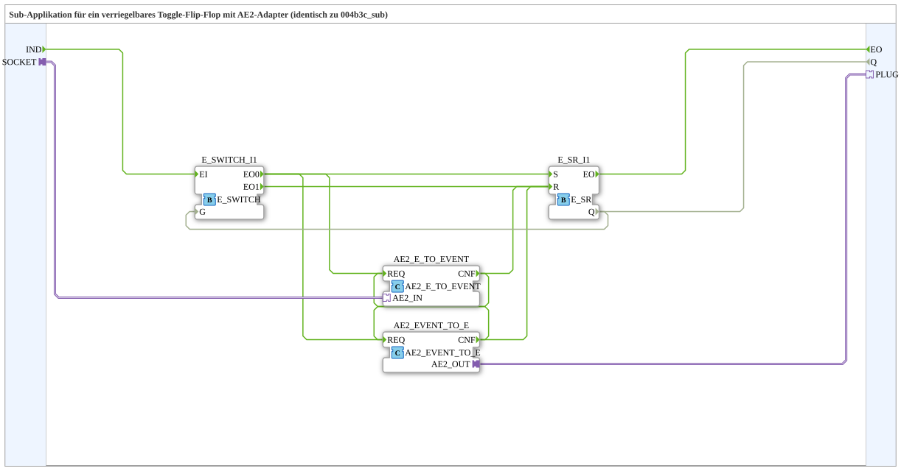

# Exercise_004b4c_sub: Sub-application for a latching toggle flip-flop with AE2 adapter (identical to 004b3c_sub)


* * * * * * * * * *
## Introduction
This exercise implements a sub-application for a latching toggle flip-flop that can communicate with other components via an AE2 adapter. The circuit is identical to that in Exercise 004b3c_sub and serves as a basis for understanding event-driven state changes with feedback and adapter-based input/output.
## Function Blocks (FBs) Used

The sub-application contains four internal function blocks that are interconnected via event, data, and adapter connections.

### Sub-Blocks: `E_SR_I1` (Type: `iec61499::events::E_SR`)
- **Type**: Event-driven SR flip-flop (Set/Reset)
- **Internal Function Blocks Used**: None (Primitive Function Block)
- **Parameters**: None (Standard Configuration)
- **Event Inputs**:
- `S`: Set event (sets output `Q` to TRUE)
- `R`: Reset event (sets output `Q` to FALSE)
- **Event Outputs**:
- `EO`: Output event (triggered after processing a Set/Reset)
- **Data Output**: `Q` (BOOL) – Current state of the flip-flop
- **How it works**: The function block stores a Boolean state. When an event occurs at input `S`, `Q` is set to TRUE; when `R` is set to FALSE. After each change, `EO` is triggered.

```
### Sub-Blocks: `E_SWITCH_I1` (Type: `iec61499::events::E_SWITCH`)

- **Type**: Event-driven switch
- **Internal Function Blocks Used**: None (Primitive Function Block)
- **Parameters**: None (Default)
- **Event Input**:
- `EI`: Input event (passed to one of the outputs)
- **Data Input**:
- `G` (BOOL): Control signal – if TRUE, `EI` is passed to `EO0`, if FALSE, to `EO1`
- **Event Outputs**:
- `EO0`: Output when `G = TRUE`
- `EO1`: Output at `G = FALSE`
- **Functionality**: An incoming event is passed to one of the two outputs depending on the value of the `G` input. This serves to distinguish between setting and resetting the flip-flop.

### Sub-Blocks: `AE2_EVENT_TO_E` (Type: `adapter::conversion::bidirectional::AE2_EVENT_TO_E`)
- **Type**: Adapter Converter – converts an AE2 adapter event into an IEC 61499 event
- **Internal Function Blocks Used**: none (converter block)
- **Parameters**: none
- **Adapter Input**: `AE2_IN` (socket side)
- **Event Output**: `CNF` (triggered when an event arrives at the adapter)
- **Functionality**: Receives an event via the AE2 adapter (e.g., from an external block) and outputs it as a standard IEC 61499 event at output `CNF`.

### Sub-Blocks: `AE2_E_TO_EVENT` (Type: `adapter::conversion::bidirectional::AE2_E_TO_EVENT`)
- **Type**: Adapter Converter – converts an IEC 61499 event into an AE2 adapter event
- **Internal Function Blocks Used**: none (converter block)
- **Parameters**: none
- **Event Input**: `REQ` (normal event)
- **Adapter Output**: `AE2_OUT` (plug side)
- **Functionality**: An incoming IEC 61499 event is converted into an adapter event and sent externally via the `AE2_OUT` plug.

## Program Flow and Connections

The sub-application operates according to the following sequence:

1. An external event arrives at the event input `IND` of the sub-application.

2. This event is fed to `E_SWITCH_I1` at input `EI`.

3. The state of the internal flip-flop (`Q` of `E_SR_I1`) is fed back as a control signal `G` to `E_SWITCH_I1`.

If `Q = TRUE` (flip-flop is set), the event is forwarded to output `EO0`.

`` - If `Q = FALSE` (flip-flop reset) is triggered, the event is forwarded to `EO1`.

4. The output `EO0` (when set) leads to the reset input `R` of the flip-flop (via the path: `EO0` → `AE2_E_TO_EVENT.REQ` → (feedback) → `AE2_EVENT_TO_E.CNF` → `E_SR_I1.R`). **Note:** The event chain is actually wired as follows:

- `E_SWITCH_I1.EO0` goes to `E_SR_I1.S` (set).
- `E_SWITCH_I1.EO1` goes to `E_SR_I1.R` (reset).
- Additionally, both outputs are connected to the AE2 converters to send the events externally.
- The adapter converters are cross-connected (see EventConnections), so an event from `AE2_E_TO_EVENT` is passed to `AE2_EVENT_TO_E` and vice versa. This enables bidirectional communication via the adapter.

5. After processing the set or reset event, the output `EO` is triggered by `E_SR_I1` and made available as the sub-application output `EO`.

`` 6. The current state `Q` is directly output as `Q` by the sub-application.

**Adapter Connections:**

- The socket `SOCKET` of the sub-application is connected to `AE2_E_TO_EVENT.AE2_IN` – external events can be received this way.
- The plug `PLUG` is connected to `AE2_EVENT_TO_E.AE2_OUT` – internal events are sent externally.

**Learning Objectives:**

- Understanding of latching toggle flip-flops (set/reset with state feedback).
- Using event switches (`E_SWITCH`) depending on state.
- Using adapter converters for bidirectional event communication via AE2 interfaces.
- Event feedback across multiple converter stages.

**Difficulty Level:** Advanced
**Prerequisites:** SR flip-flop functionality, event-driven components, adapter concepts in 4diac.

## Summary

Exercise 004b4c_sub demonstrates the construction of a latching toggle flip-flop that changes its state only on every second input event (toggle). The latching is achieved by feeding the current state back to the input of a `E_SWITCH`. Using AE2 adapter plugs and sockets, the sub-application can exchange events with other components, making it ideal for distributed automation systems.

* * * * * * * * * *

---

### 🌐 Related topic subpages on ms-muc-docs.de
* [🌐 Eclipse 4diac IDE & Color Reference on ms-muc-docs.de](https://www.ms-muc-docs.de/iec-61499/eclipse-4diac/)
* [🌐 IEC 61499 Events – The Pulse of Automation on ms-muc-docs.de](https://www.ms-muc-docs.de/iec-61499/events/event/)

]
