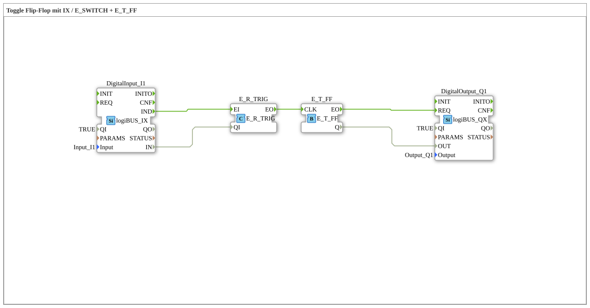

# Exercise_004b5: Toggle Flip-Flop with IX / E_SWITCH + E_T_FF

* * * * * * * * * *
## Introduction
This exercise demonstrates the implementation of a toggle flip-flop (T-FF) using the function blocks `E_R_TRIG` (rising edge detection) and `E_T_FF` (toggle flip-flop). A digital input (IX) is used as a push button – each rising edge at the input toggles the digital output (QX). This setup is suitable, for example, for switching a light on and off with a single push button.
## Function Blocks Used (FBs)

The subapplication consists of four function blocks:

- **DigitalInput_I1**: Type `logiBUS::io::DI::logiBUS_IX`
- **Description**: Reads a digital input from the fieldbus (e.g., a push button).
- **Parameters**: `QI = TRUE` (input quality active), `Input = Input_I1` (physical channel).
- **Event Outputs**: `IND` (triggered when the input state changes).
- **Data Output**: `IN` (current digital value).
- **E_R_TRIG**: Type `iec61499::events::E_R_TRIG`
- **Description**: Detects a rising edge of the input signal.
- **Inputs**:
- Event: `EI` (Start of processing).
- Data: `QI` (Quality of the input value, here connected to `DigitalInput_I1.IN`).
- **Outputs**:
- Event: `EO` (triggered precisely on a rising edge of `QI`).
- **E_T_FF**: Type `iec61499::events::E_T_FF`
- **Description**: Toggle flip-flop – the internal state is inverted on every event at input `CLK`.
- **Inputs**:
- Event: `CLK` (Clock, here fed by `E_R_TRIG.EO`).
- **Outputs**:
- Event: `EO` (triggered once after a state change).
- Data: `Q` (current state of the flip-flop, TRUE/FALSE).
- **DigitalOutput_Q1**: Type `logiBUS::io::DQ::logiBUS_QX`
- **Description**: Sets a digital output on the fieldbus (e.g., a light).
- **Parameters**: `QI = TRUE` (output enabled), `Output = Output_Q1` (physical channel).
- **Event Inputs**: `REQ` (Request to write to the output).
- **Data Input**: `OUT` (Desired digital value).

## Program Flow and Connections
The subapplication is implemented as an event-driven chain:

1. **Input Change**: The block `DigitalInput_I1` monitors the physical input. As soon as the state changes, the event `IND` is triggered.

2. **Edge Detection**: The event `IND` is forwarded to the event input `EI` from `E_R_TRIG` (**Event Connection**: `DigitalInput_I1.IND → E_R_TRIG.EI`). In parallel, the current digital value (`DigitalInput_I1.IN`) is passed to the data input `QI` from `E_R_TRIG` (**Data connection**: `DigitalInput_I1.IN → E_R_TRIG.QI`).

`E_R_TRIG` checks whether the value of `QI` has a rising edge (change from FALSE to TRUE). If this is the case, an event is generated at the output `EO`.

3. **Toggle Flip-Flop**: The event `EO` from `E_R_TRIG` triggers the clock input `CLK` from `E_T_FF` (**Event Connection**: `E_R_TRIG.EO → E_T_FF.CLK`). The flip-flop's state toggles with each clock cycle. The result is available at the data output `Q`. Simultaneously, the output event `EO` is triggered by `E_T_FF`.

Event `EO` is triggered by `E_T_FF`. 4. **Setting the Output**: The event `EO` from `E_T_FF` is forwarded to the `REQ` input of `DigitalOutput_Q1` (**Event Connection**: `E_T_FF.EO → DigitalOutput_Q1.REQ`). The flip-flop state (`E_T_FF.Q`) is passed as a setpoint to the data input `OUT` of `DigitalOutput_Q1` (**Data Connection**: `E_T_FF.Q → DigitalOutput_Q1.OUT`). This sets the physical output accordingly.

**Learning Objectives**:

- Understanding event-driven processes in 4diac.
- Use of an edge detection block (`E_R_TRIG`).
- Implementation of a toggle flip-flop using `E_T_FF`.
- Coupling of digital inputs/outputs via logiBUS.

**Difficulty Level**: Beginner (after familiarity with basic function block types).

**Prerequisites**: Basic experience with the 4diac IDE, knowledge of event and data connections.

## Summary
This exercise implemented a typical push-button switch function (toggle). By combining `E_R_TRIG` and `E_T_FF`, each rising edge at the input is detected, and the output state is toggled. The blocks are loosely coupled – an advantage of event-driven programming. The subapplication can be directly integrated into a 4diac project and run on a suitable target system (with logiBUS connectivity).

---

### 🌐 Related topic subpages on ms-muc-docs.de
* [🌐 Eclipse 4diac IDE & Color Reference on ms-muc-docs.de](https://www.ms-muc-docs.de/iec-61499/eclipse-4diac/)

]