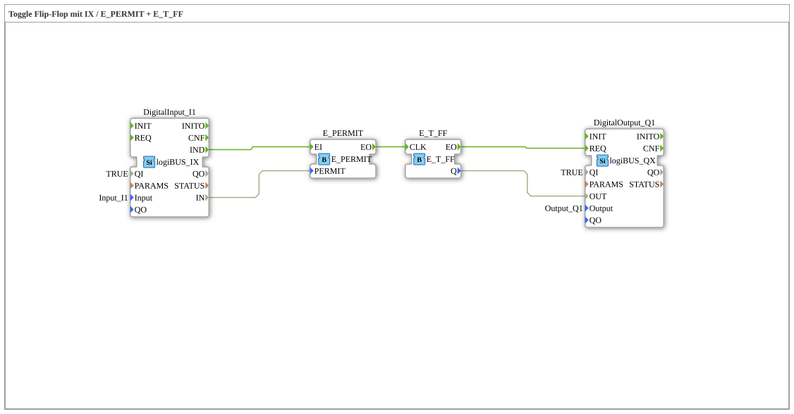

# Exercise_004b6: Toggle Flip-Flop with IX / E_PERMIT + E_T_FF

* * * * * * * * * *

## Introduction

This exercise implements a toggle flip-flop (T-FF) using a digital input (logiBUS_IX) and the function blocks **E_PERMIT** and **E_T_FF**.
The digital input serves as an enable signal (PERMIT) for a clock signal that toggles the flip-flop's state. The output is connected to a digital output (logiBUS_QX).

## Function Blocks Used (FBs)

### DigitalInput_I1

- **Type**: `logiBUS::io::DI::logiBUS_IX`
- **Parameters**:
- `QI` = `TRUE`
- `Input` = `Input_I1`
- **Function**: Reads the state of the connected digital input signal and provides the value at the data output `IN`. A signal change triggers the event `IND`.

### E_PERMIT

- **Type**: `iec61499::events::E_PERMIT`
- **Parameters**: none
- **Event Input/Output**:
- `EI` (Event Input)
- `EO` (Event Output)
- **Data Input**:
- `PERMIT` (BOOL)
- **Function**: Passes an event received at `EI` to output `EO` only if the value of `PERMIT` = `TRUE`. Serves as an enable/disable element.

### E_T_FF

- **Type**: `iec61499::events::E_T_FF`
- **Parameters**: none
- **Event Input/Output**:
- `CLK` (Event Input)
- `EO` (Event Output)
- **Data Output**:
- `Q` (BOOL)
- **Function**: Toggle flip-flop. At each clock cycle (event at `CLK`), the output `Q` toggles its state. Simultaneously, the event `EO` is triggered.

### DigitalOutput_Q1

- **Type**: `logiBUS::io::DQ::logiBUS_QX`
- **Parameters**:
- `QI` = `TRUE`
- `Output` = `Output_Q1`
- **Function**: Sets the digital output according to the value present at data output `OUT`. The update is triggered by the event `REQ`.

## Program Flow and Connections

**Event Connections**:

- `DigitalInput_I1.IND` → `E_PERMIT.EI`
- `E_PERMIT.EO` → `E_T_FF.CLK`
- `E_T_FF.EO` → `DigitalOutput_Q1.REQ`

**Data Connections**:

- `DigitalInput_I1.IN` → `E_PERMIT.PERMIT`
- `E_T_FF.Q` → `DigitalOutput_Q1.OUT`

**Process**:

As soon as the digital input changes, the event `IND` is triggered. The current state of the input (`IN`) is passed to the function block `E_PERMIT` as `PERMIT`.

- If `PERMIT = TRUE` is the current state, the event is forwarded to the clock input (`CLK`) of the toggle flip-flop.
- The `E_T_FF` then toggles its output `Q`.
- Simultaneously, the event `EO` is sent from `E_T_FF` to the digital output, which receives the new value from `Q`.

... **Learning Objectives**:

- Understanding the toggle flip-flop (T-FF)
- Application of the enable block `E_PERMIT`
- Interaction of event and data flows in IEC 61499

**Difficulty Level**: Medium
**Prerequisites**: Fundamentals of event-driven logic and digital inputs/outputs

**Starting the Exercise**:

Insert the sub-app `Uebung_004b6` into a 4diac project, connect the hardware resources (e.g., physical input `Input_I1` and output `Output_Q1`), and run the application.

## Summary

This exercise demonstrates a toggle flip-flop that only changes its state when a digital input is active. By combining `E_PERMIT` and `E_T_FF`, a clock signal can be enabled – useful for applications such as debounced pushbuttons or mode switching.

---

### 🌐 Related topic subpages on ms-muc-docs.de

- [🌐 Eclipse 4diac IDE & color reference on ms-muc-docs.de ](https://www.ms-muc-docs.de/iec-61499/eclipse-4diac/)

]
