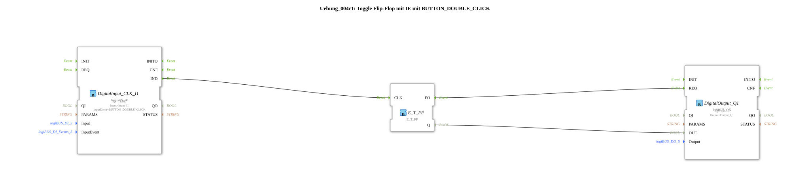

# Exercise_004c1: Toggle Flip-Flop with IE using BUTTON_DOUBLE_CLICK

This article describes the logiBUS® exercise `Uebung_004c1`. From here on, we will focus on the advanced capabilities of the `logiBUS_IE` block, which can recognize complex button patterns.
----
## Objective of the Exercise
Using the `BUTTON_DOUBLE_CLICK` event to control a memory function.

-----

## Description and Components

[cite_start]The subapplication `Uebung_004c1.SUB` toggles a lamp only on a double-click[cite: 1].

### Function Blocks (FBs)

* **`DigitalInput_CLK_I1`**: Type `logiBUS_IE`. This is configured as `BUTTON_DOUBLE_CLICK` in the parameter `InputEvent`.
* **`E_T_FF`**: The toggle flip-flop.

-----

## Functionality

The input block monitors the timing pattern at the hardware pin `I1`.

1. A simple key press is ignored (no event at `IND`).

2. If two clicks are detected within a defined time (usually < 500 ms), the function block fires the event `IND` **once**.

3. This event triggers the flip-flop, which toggles the lamp's state.

-----

## Application Example

**Preventing Incorrect Operation**: Critical commands (such as "Stop all motors" or "Clear data") can be assigned to a double-click, so that accidentally touching the button has no consequences.