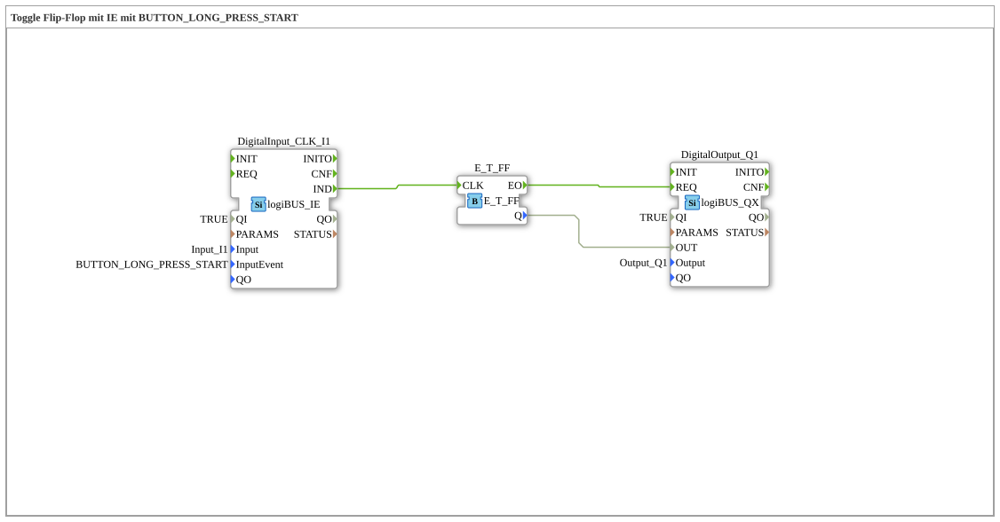

# Exercise_004c2: Toggle Flip-Flop with IE using BUTTON_LONG_PRESS_START

[(https://notebooklm.google.com/notebook/a6872e59-1dfc-4132-a118-aff1bc7bc944)
This article describes the logiBUS® exercise `Uebung_004c2`
----

## Objective of the Exercise

Using the event `BUTTON_LONG_PRESS_START`.

-----

## Functionality

[cite_start]The function block `DigitalInput_CLK_I1` in `Uebung_004c2.SUB` responds to a long press[cite: 1].

The event `IND` is fired precisely when the predefined time for a "long press" (e.g., 1 second) has elapsed – even if the button remains pressed afterward. A short press does not trigger this event.

----

## Application Example

**Menu Navigation**: In many controllers, a short click takes you to the next page, while a long press (`LONG_PRESS_START`) opens the setup menu.
