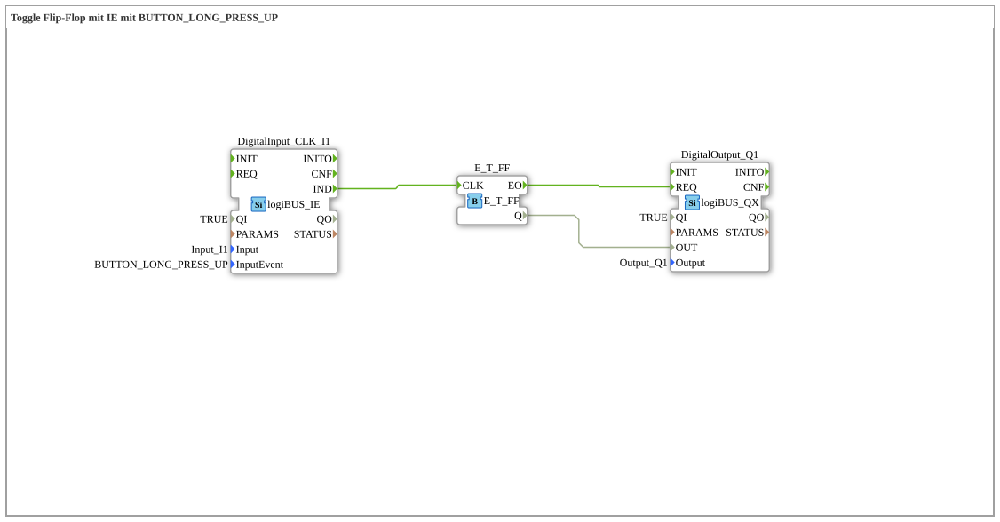

# Exercise_004c3: Toggle Flip-Flop with IE using BUTTON_LONG_PRESS_UP

This article describes the logiBUS® exercise `Uebung_004c3`.

----

## Objective of the Exercise

Using the event `BUTTON_LONG_PRESS_UP`.

-----

## Functionality

[cite_start]The function block `DigitalInput_CLK_I1` in `Uebung_004c3.SUB` detects the end of a long press[cite: 1].

Unlike the `START` event, `LONG_PRESS_UP` only fires when the user **releases** the button, provided it was pressed for a sufficient duration. This allows actions to be triggered precisely at the end of an interaction.

-----

## Application Example

**Confirmation Dialog**: The user must press and hold a button to confirm that they want the action. The execution (e.g., "Start engine") only occurs upon release as final confirmation.