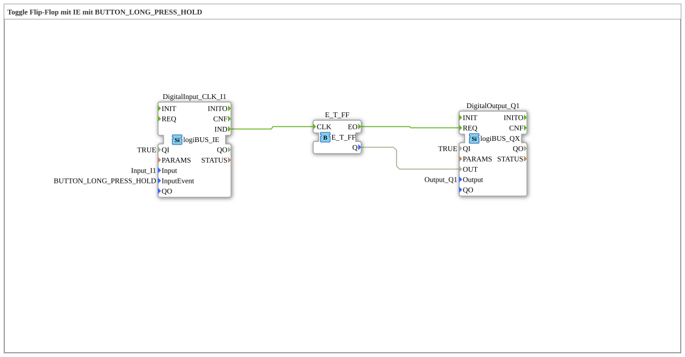

# Exercise_004c4: Toggle Flip-Flop with IE using BUTTON_LONG_PRESS_HOLD

This article describes the logiBUS® exercise `Uebung_004c4`.
----
## Objective of the Exercise

Using the event `BUTTON_LONG_PRESS_HOLD`.

-----

## Functionality

[cite_start]The function block `DigitalInput_CLK_I1` in `Uebung_004c4.SUB` is configured to hold permanently[cite: 1].

This event is **repeated periodically** (e.g., every 200 ms) as long as the button is held down after the initial detection of the long press. Since a toggle flip-flop is connected to the output in this exercise, this causes the lamp to rapidly switch on and off (blink) as long as the finger is on the button.

-----

## Application Example

**Value Increment**: As long as a button is held down, a value (e.g., the target temperature or the motor speed) continuously increments.