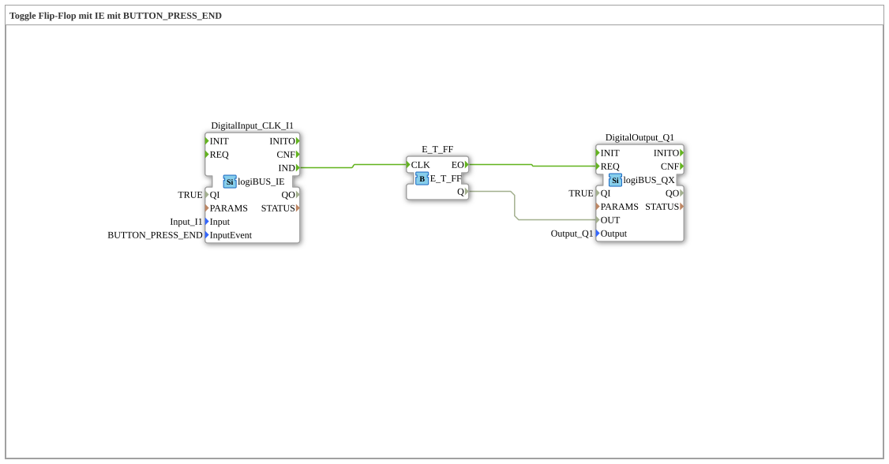

# Exercise_004c5: Toggle Flip-Flop with IE using BUTTON_PRESS_END

This article describes the logiBUS® exercise `Uebung_004c5`.

----

## Objective of the Exercise

Using the event `BUTTON_PRESS_END`.

-----

## Functionality

[cite_start]The function block `DigitalInput_CLK_I1` in `Uebung_004c5.SUB` reacts to every falling edge[cite: 1].

This event fires **always** when the button is released – regardless of whether it was pressed briefly (`CLICK`) or for a longer period (`LONG_PRESS`). It is the universal event for the end of an interaction.

-----

## Application Example

**Safety Stop**: A function (e.g., a crane arm) moves as long as the button is pressed. As soon as the finger is removed (`PRESS_END`), the movement must stop immediately, no matter how brief the press was.