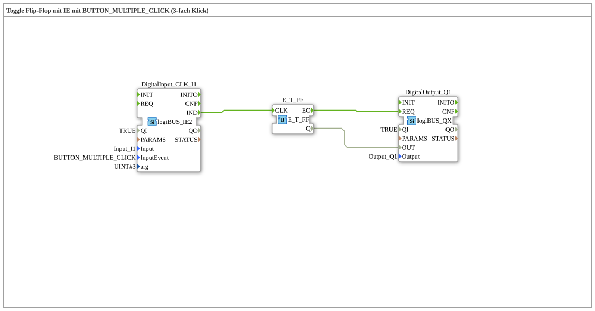

# Exercise_004c6: Toggle Flip-Flop with IE using BUTTON_MULTIPLE_CLICK (3-click)

This article describes the logiBUS® exercise `Uebung_004c6`. Here, the extended function block `logiBUS_IE2` is used to evaluate a specific number of clicks.
----
## Objective of the exercise
Configuration of an n-click using arguments.

-----

## Description and Components

[cite_start]The subapplication `Uebung_004c6.SUB` uses the function block type `logiBUS_IE2` with the event `BUTTON_MULTIPLE_CLICK` and the argument `arg = 3`[cite: 1].

----

## Functionality

This function block counts the clicks within a time window. Only if the user presses the button **exactly three times** in quick succession is the event `IND` triggered and the indicator light toggles. All other click combinations are discarded.

----

## Application Example

**Hidden expert functions**: Access to calibration modes or service menus that are not intended to be directly visible to the average user. A triple-click is a deliberate action that rarely occurs accidentally during normal operation.