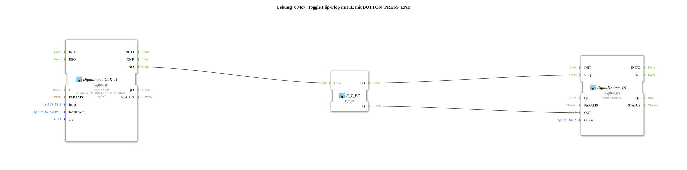

# Exercise_004c7: Toggle Flip-Flop with IE using BUTTON_PRESS_END

This article describes the logiBUS® exercise `Uebung_004c7`. Here, too, the function block `logiBUS_IE2` is used to customize the hold time for an event.
----
## Objective of the Exercise
To define a specific duration for a long key press.

-----

## Description and Components

[cite_start]The subapplication `Uebung_004c7.SUB` uses `logiBUS_IE2` with `BUTTON_LONG_PRESS_START` and the argument `arg = 3000`[cite: 1].

-----

## Functionality

The unit of argument `arg` is milliseconds. This means that the event `IND` is only triggered if the button has been pressed continuously for **at least 3 seconds** (3000 ms). This overrides the system's default value for "Long Press".

----

## Application Example

**Load Factory Settings (Factory Reset)**: A critical action that requires very deliberate and prolonged user interaction to absolutely prevent accidental data loss.