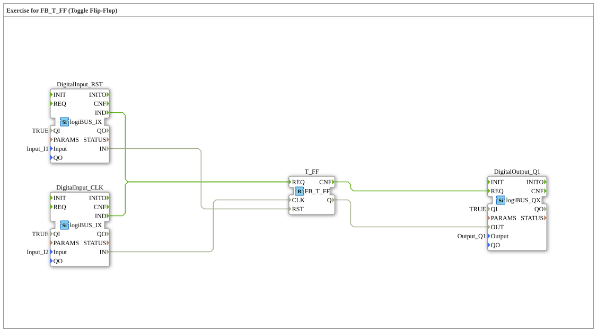

# Exercise_004d_T: Exercise for FB_T_FF (Toggle Flip-Flop)

* * * * * * * * * *
## Introduction
This exercise demonstrates the application of the function block **FB_T_FF** (Toggle Flip-Flop).
A toggle flip-flop changes its output state on each rising edge of the clock signal (CLK). Additionally, the output can be reset by a reset signal (RST).

In this exercise, two digital inputs are used as clock and reset sources. The T-FF block processes the signals and controls a digital output. The goal is to understand the basic switching behavior of a toggle flip-flop in an automation environment.

## Function Blocks Used (FBs)

This exercise consists of four function blocks connected in the SubApp network:

### DigitalInput_RST (logiBUS_IX)
- **Type**: `logiBUS::io::DI::logiBUS_IX`
- **Parameters**: 
QI = TRUE` (Qualifier for initialization active) 
Input = Input_I1` (Physical input of the logiBUS terminal)

- **Functionality**: Reads the digital input `Input_I1`. The event `IND` is triggered upon signal change. The read value is provided at the data output `IN`. Serves as a reset signal for the T-FF.

### DigitalInput_CLK (logiBUS_IX)
- **Type**: `logiBUS::io::DI::logiBUS_IX`
- **Parameters**: 
QI = TRUE` 
Input = Input_I2`

- **Functionality**: Reads the digital input `Input_I2`. The event `IND` is triggered upon a signal change. The read value is provided at the data output `IN`. Serves as a clock signal for the T-FF.

### T_FF (FB_T_FF)
- **Type**: `logiBUS::bistableElements::FB_T_FF`
- **Parameters**: No explicit parameters; the interfaces are defined via connections.
- **Functionality**: Implements a toggle flip-flop.
- **Event input `REQ`**: Starts processing.
- **Data input `CLK`**: Clock signal (boolean). On the rising edge of `CLK`, the internal state is toggled.
- **Data input `RST`**: Reset signal (boolean). On `TRUE`, the output is immediately set to `FALSE`, regardless of the clock signal.
- **Data output `Q`**: Current state of the flip-flop.
- **Event output `CNF`**: Triggered after processing is complete.

### DigitalOutput_Q1 (logiBUS_QX)
- **Type**: `logiBUS::io::DQ::logiBUS_QX`
- **Parameters**: 
QI = TRUE` 
Output = Output_Q1`

- **Functionality**: Receives the state of the T-FF via the data input `OUT` and outputs it at the physical output `Output_Q1`. The output is updated by the event `REQ`.

```
## Program Flow and Connections

1. **Event Chaining**:

- Both digital inputs (`DigitalInput_RST` and `DigitalInput_CLK`) are connected via their event output `IND` to the event input `REQ` of `T_FF`.
- This means: Any change to either input triggers processing of the T-FF.
- After processing of the T-FF, the event output `CNF` is connected to the `REQ` input of `DigitalOutput_Q1`, so that the output value is immediately passed on to the hardware.

`` 2. **Data Chaining**:

- The value read from the reset input (`DigitalInput_RST.IN`) is connected to the `RST` input of the T-FF.
- The value read from the clock input (`DigitalInput_CLK.IN`) is connected to the `CLK` input of the T-FF.
- The output of the T-FF (`T_FF.Q`) is connected to the `OUT` input of the digital output `DigitalOutput_Q1`.
... 3. **Operational Functionality**:

- When `Input_I2` (clock) changes from `FALSE` to `TRUE` (rising edge), the output `Q` of the T-FF toggles.
- If `Input_I1` (reset) is set to `TRUE` simultaneously or later, `Q` immediately becomes `FALSE` (asynchronous reset).
- The current state of `Q` appears at the output `Output_Q1`.

` ``` ``Input_I2` (clock) changes from `FALSE` to `TRUE` (rising edge), the output `Q` toggles the output `Q` to ... **Learning Objectives:**

- Understand the functionality of a toggle flip-flop (T-FF).
- Event-driven data flow modeling in 4diac (IEC 61499).
- Simple connection of hardware inputs/outputs with logic gates.

**Difficulty Level:** Easy (basic exercise).

**Prerequisites:** Fundamentals of digital technology, introduction to the 4diac IDE.

**Starting the Exercise:**

1. Load the project into the 4diac IDE (the subapp `Uebung_004d_T` is contained in the class `Uebungen`).

2. Assign the inputs `Input_I1` and `Input_I2`, as well as the output `Output_Q1`, to the corresponding logiBUS terminals of your hardware.

3. Start the application and observe its behavior by applying signals to the inputs.

## Summary

Exercise `Uebung_004d_T` demonstrates the use of the function block `FB_T_FF` to implement a toggle flip-flop. By coupling digital inputs, the T-FF, and a digital output, the basic switching behavior—toggling on the clock edge and asynchronous reset—is demonstrated. The simple event and data chaining makes this exercise an ideal introduction to working with bistable elements under IEC 61499.

---

### 🌐 Related topic subpages on ms-muc-docs.de
* [🌐 Eclipse 4diac IDE & color reference on ms-muc-docs.de](https://www.ms-muc-docs.de/iec-61499/eclipse-4diac/)

]
