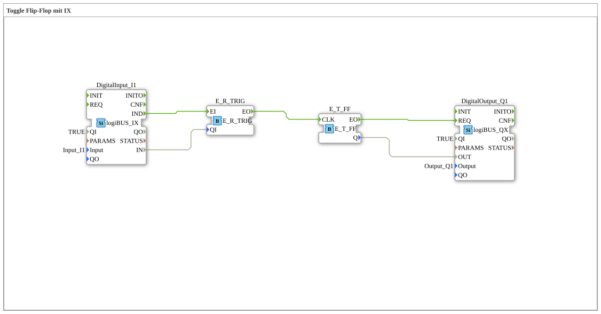

# Exercise_005: Toggle Flip-Flop with IX

[](https://notebooklm.google.com/notebook/a6872e59-1dfc-4132-a118-aff1bc7bc944)

This article describes the logiBUS® exercise `Uebung_005`. It demonstrates how a state-based hardware input (`IX`) can be used to control an event-based toggle flip-flop.

## 🎧 Podcast



* [Automation Decoded: Control, Control, Regulate – The Invisible Language of Technology (DIN IEC 60050-351)](https://podcasters.spotify.com/pod/show/ms-muc-lama/episodes/Automatisierung-entschlsselt-Leiten--Steuern--Regeln--Die-unsichtbare-Sprache-der-Technik-DIN-IEC-60050-351-e36t52b)

----

## Objective of the Exercise

Understanding edge detection using event switches. This section demonstrates how to generate a single switching pulse from a continuous signal (button pressed) without using the specialized `logiBUS_IE` function block.

-----

## Description and Components

[cite_start]The subapplication `Uebung_005.SUB` combines a standard input (`IX`) with an event gate to clock a flip-flop[cite: 1].

### Function Blocks (FBs)

* **`DigitalInput_I1`**: Type `logiBUS_IX`. Provides an event on each level change (press and release).

* **`E_SWITCH`**: Serves as a gate to allow only one of the two edges to pass.

* **`E_T_FF`**: The Toggle Flip-Flop.

-----

## Functionality

The circuit uses the data connection from the input to the gate of the switch:


```xml
<EventConnections>
    <Connection Source="DigitalInput_I1.IND" Destination="E_SWITCH.EI"/>
    <Connection Source="E_SWITCH.EO1" Destination="E_T_FF.CLK"/>
</EventConnections>
<DataConnections>
    <Connection Source="DigitalInput_I1.IN" Destination="E_SWITCH.G"/>
</DataConnections>
```


[cite_start][cite: 1]

The functional sequence:

1. **Push**: `I1` changes from FALSE to TRUE. A `IND` event is sent. Since the input `G` of the switch is now TRUE, the event is forwarded to `EO1` ➡️ `CLK`. The light toggles.

2. **Release**: `I1` changes back to FALSE. Another `IND` event is sent. Since the input `G` is now FALSE, the event is routed to `EO0` (not connected here). The flip-flop does not react.

Result: The lamp only switches on when the button is pressed (rising edge).

-----

## Evaluation

This setup illustrates the interaction between data (`G`) and events (`EI`). In practice, however, using a `logiBUS_IE` function block (see Exercise 004a) is more efficient for this task.