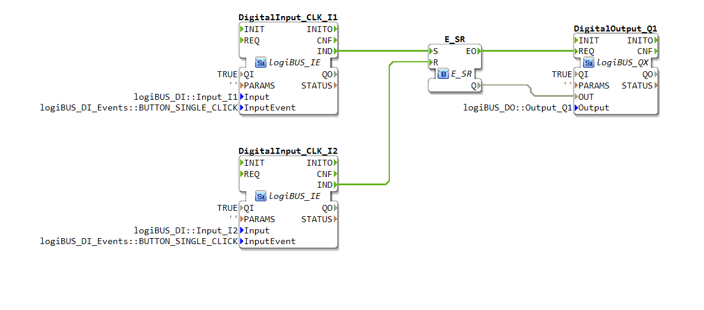
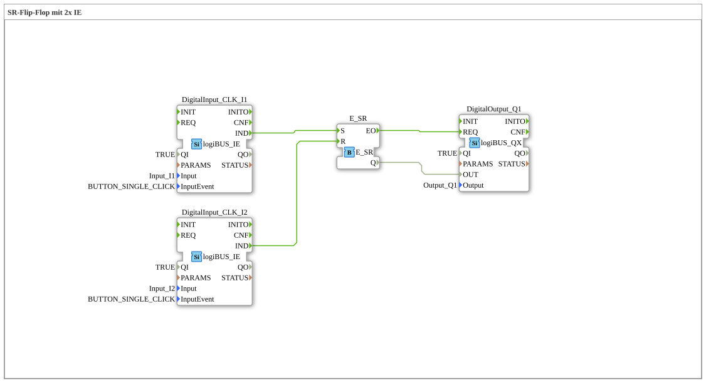

# Exercise_006: SR Flip-Flop with 2x IE

[(https://notebooklm.google.com/notebook/a6872e59-1dfc-4132-a118-aff1bc7bc944)
This article describes the logiBUS® exercise `Uebung_006`. Here, a classic self-holding memory with separate pushbuttons for on and off is implemented
----

## Objective of the Exercise

Implementation of a circuit with separate set and reset logic using event-based logic gates.

-----

## Description and Components

[cite_start]The subapplication `Uebung_006.SUB` uses two event-based inputs and an SR memory [cite: 1].

### Function Blocks (FBs)

- **`I1` (Set)**: Pushbutton for switching on (configured for single click).
- **`I2` (Reset)**: Pushbutton for switching off (configured for single click).
- **`E_SR`**: An event-based memory block. [cite_start]An event at the input `S` (Set) sets the output `Q` to TRUE, an event at the input `R` (Reset) sets it to FALSE[cite: 1].

-----

## Functionality

<EventConnections>
<Connection Source="DigitalInput_CLK_I1.IND" Destination="E_SR.S"/>
<Connection Source="DigitalInput_CLK_I2.IND" Destination="E_SR.R"/>
<Connection Source="E_SR.EO" Destination="DigitalOutput_Q1.REQ"/>
</EventConnections>

[cite_start][cite: 1]

- One click on button 1 ➡️ Memory is set ➡️ Light turns on.
- One click on button 2 ➡️ Memory is cleared ➡️ Light turns off.
- Pressing button 1 again when the light is already on has no effect.

-----

## Application Example

**Industrial Start/Stop Control**: A green button starts a machine, a red button stops it. This is safer than a single toggle button because the operator can always issue a defined command ("I want to turn it off"), regardless of the current state.
