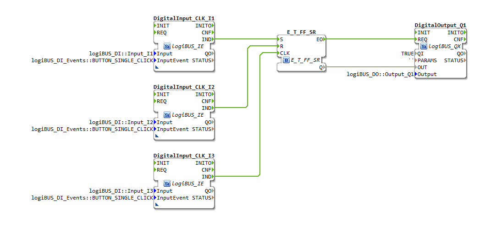
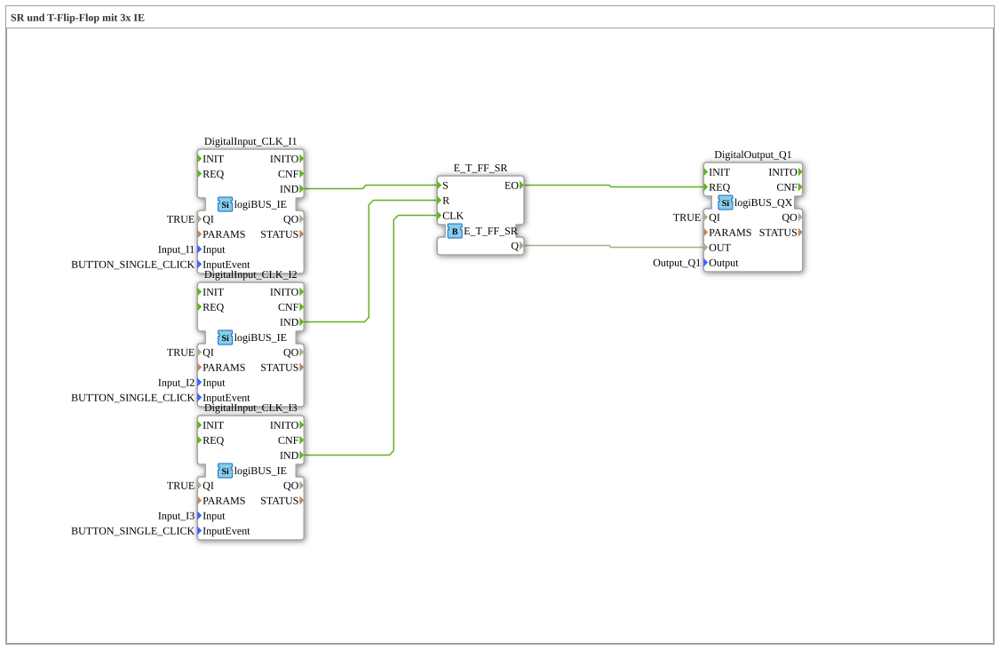

# Exercise_006a: SR and T Flip-Flop with 3x IE

This article describes the logiBUS® exercise `Uebung_006a`. It uses a highly flexible memory module that combines three different operating modes.
----

## Objective of the Exercise

Introduction of the `E_T_FF_SR` module. This module combines the functions of a toggle flip-flop with those of an SR memory.

-----

## Description and Components

[cite_start]The subapplication `Uebung_006a.SUB` links three separate pushbuttons to a central memory element[cite: 1].

### Function Blocks (FBs)

* **`I1` (Set)**: Turns the output on.
* **`I2` (Reset)**: Turns the output off.
* **`I3` (Toggle)**: Changes the current state.
* **`E_T_FF_SR`**: The combined function block for all three event types.

-----

## Functionality

The function block reacts to each of the three input events individually:

* An event at `S` sets the state permanently to `TRUE`.
* An event at `R` sets the state to `FALSE`.
* An event at `CLK` inverts the current state (toggle).

All events result in an update of output `Q` and trigger the confirmation event `EO` to control the hardware.

-----

## Application Example

**Building Lighting Control**:

* **Local**: A button in the room toggles the light (`I3`).
* **Central**: At the entrance, there is a "Good Night" button that turns off all lights via a reset (`I2`).
* **Alarm system**: In the event of a break-in, the control panel permanently activates all lights via a set (`I1`).