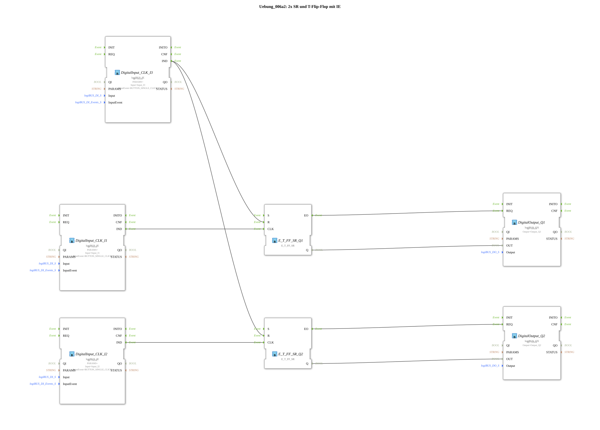

# Exercise_006a2: 2x SR and T Flip-Flop with IE

This article describes the logiBUS® exercise `Uebung_006a2`.
----
## Objective of the exercise

Implementation of a "central off" function for multiple independent memory elements.

-----

## Description and Components

[cite_start]The subapplication `Uebung_006a2.SUB` controls two separate lamps (`Q1`, `Q2`) via two pushbuttons (`I1`, `I2`), which can be reset together by a third pushbutton (`I3`)[cite: 1].

### Function Blocks (FBs)

* **2x `E_T_FF_SR`**: One for each light channel.
* **`I1` & `I2`**: Buttons for individually switching the channels.
* **`I3`**: Shared Reset Button.

------

## Functionality

The logic uses the fan-out principle for events:

* `I1` is connected to `CLK` of flip-flop 1.
* `I2` is connected to `CLK` of flip-flop 2.
* `I3` (Reset) is connected to the `R` inputs of **both** flip-flops.

Pressing `I3` immediately turns off all lamps in the system, regardless of their previous state.

-----

## Application Example

**Workshop Lighting**: Each machine has its own work light. At the end of the workday, the workshop manager can switch off all the lights simultaneously using a central switch by the door.