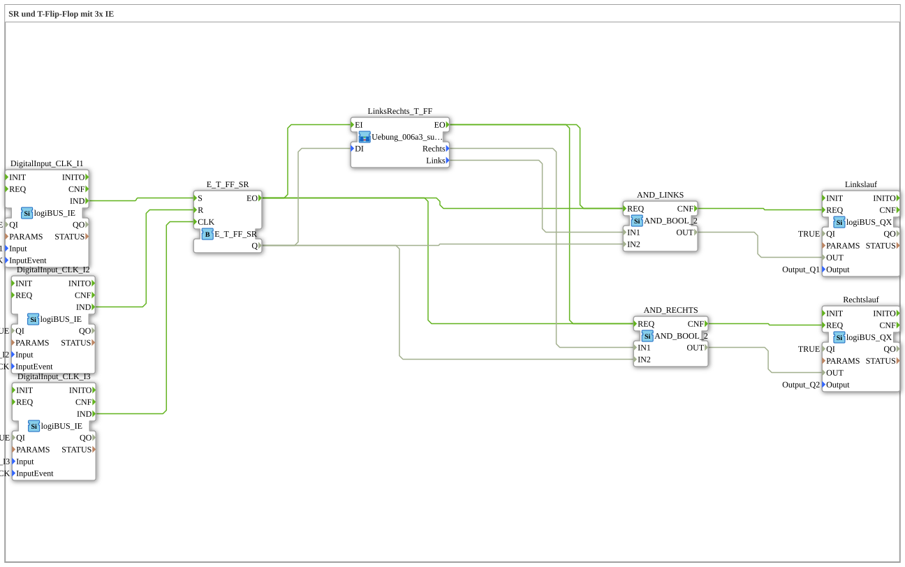

# Exercise_006a3: SR and T Flip-Flop with 3x IE

This article describes the logiBUS® exercise `Uebung_006a3`. This is a more complex application for controlling a motor with two directions of rotation and automatic switching.

----

## Objective of the Exercise

To build a control system for forward and reverse operation with software interlock. It must be ensured that both directions can never be controlled simultaneously.

-----

## Description and Components

[cite_start]The sub-application `Uebung_006a3.SUB` combines a main on/off memory with logic for direction selection[cite: 1].

### Function Blocks (FBs)

* **`E_T_FF_SR`**: Determines whether the motor is running (On/Off).

* **`LinksRechts_T_FF` (SubApp)**: An internal marker that changes the direction every time the motor starts.

* **2x `AND_2_BOOL`**: Link the "On" signal to the selected direction.

* **`Q1` (Counter-clockwise) & `Q2` (Counter-clockwise)**: The hardware outputs.

-----

## Functionality

1. The user starts the system via `I1`, `I2`, or `I3`.

2. The flip-flop provides a "Global On" signal.

3. The sub-application `LinksRechts_T_FF` determines which branch is active.

4. The AND gates allow the "On" signal to pass to only one of the two outputs.

This circuit demonstrates how to solve complex decisions by combining basic functions (memory, logic gates, sub-applications).

-----

## Application Example

**Reversing Agitator**: A motor in a mixing tank should change its direction of rotation each time it is switched on to achieve better mixing of the medium. The software ensures that the motor only receives current in one direction at a time.