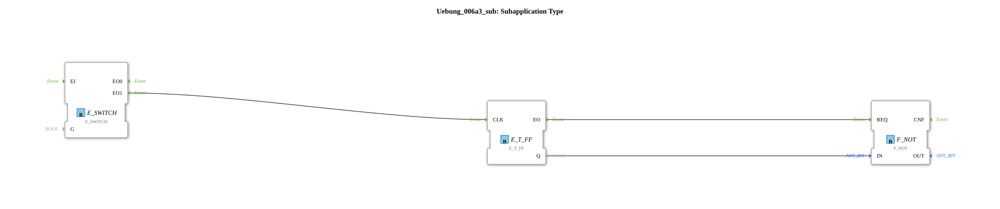

# Exercise_006a3_sub: Subapplication Type

This article describes the sub-application type `Uebung_006a3_sub`. It serves as an internal state machine for implementing an alternating direction change.
----
## Overview

[cite_start]This function block encapsulates the logic for a left/right switch[cite: 1].

It has an event input `EI`. Upon each occurrence of an event, the function block internally changes its direction setting. The results are provided via the data outputs `Links` and `Rechts`.

[cite_start]This function block encapsulates the logic for a left/right switch.[cite: 1]

It has an event input `EI`. Upon each occurrence of an event, the function block internally changes its direction setting. The results are provided via the data outputs `Links` and `Rechts`.

[cite_start] This is used in exercise 006a3 to automatically reverse the direction of rotation of a motor during each start-up. The function block ensures that a clear direction decision is always made.

## 🛠️ Related Exercises

* [Exercise_006a3](Uebung_006a3.md)
