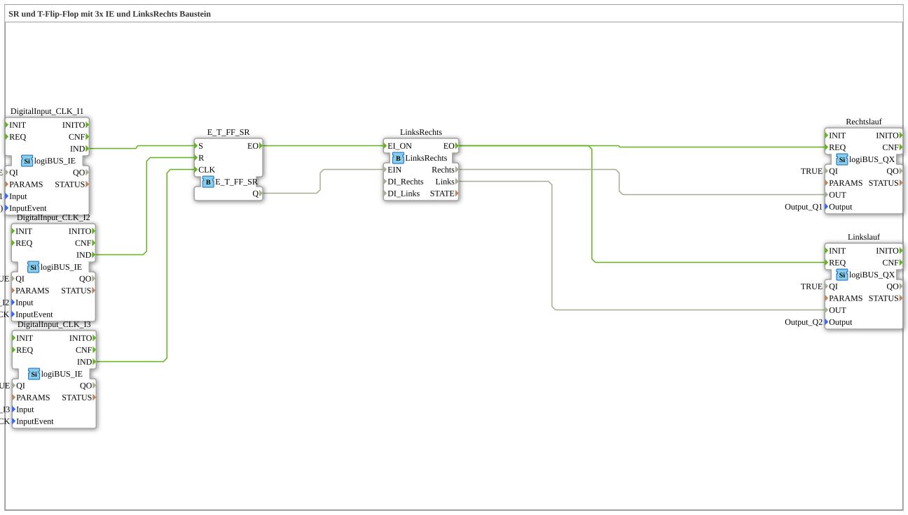

# Exercise_006a4: SR and T Flip-Flop with 3x IE and LeftRight Block

This article describes the logiBUS® exercise `Uebung_006a4`. Here, the motor control from the previous exercise is optimized by using a ready-made library block.
----
## Objective of the Exercise

Using specialized service blocks to reduce diagram complexity.

-----

## Description and Components

[cite_start]In `Uebung_006a4.SUB`, the network of gates and sub-applications is replaced by the block `LinksRechts`[cite: 1].

### Function Blocks (FBs)

* **`LinksRechts`**: Type `logiBUS::utils::sequence::verteiler::LinksRechts`. [cite_start]This block handles the complete management of the two outputs, including the internal direction logic[cite: 1].
* **`E_T_FF_SR`**: Also provides the start signal to the input `EI_ON`.

-----

## Advantage

Using library blocks makes the program more readable and easier to maintain. The internal interlock is hard-coded in the block and cannot be accidentally bypassed by faulty connections in the main diagram.