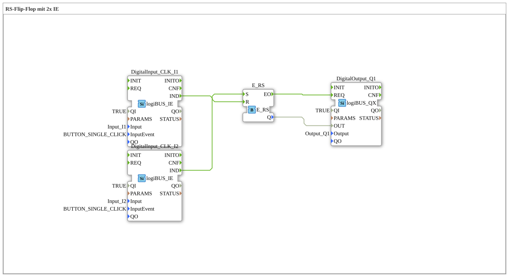

# Exercise_006b: RS Flip-Flop with 2x IE

This article describes the logiBUS® exercise `Uebung_006b`.

----

## Objective of the Exercise

Understanding reset priority.

-----

## Description and Components

[cite_start]The subapplication `Uebung_006b.SUB` uses a function block `E_RS`[cite: 1].

### Function Blocks (FBs)

* **`E_RS`**: An event-based RS flip-flop (reset dominant).

-----

## Functionality

Functionally very similar to the SR memory (Exercise 006). The crucial difference lies in the behavior under "simultaneity": If both a set and a reset event occur at precisely the same moment, the **reset** event takes precedence for `E_RS`. The output is therefore reliably switched to `FALSE`.

----

## Application Example

**Emergency Shutdown**: In a machine, the stop command always takes precedence. If a fault condition triggers the stop, a simultaneous start attempt by the operator must not prevent the shutdown. An RS gate is absolutely necessary here.