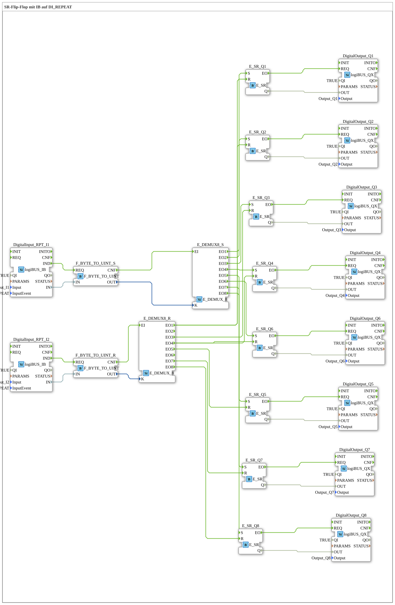

# Exercise_006c: SR Flip-Flop with IB on DI_REPEAT

[(https://notebooklm.google.com/notebook/a6872e59-1dfc-4132-a118-aff1bc7bc944)
This article describes the logiBUS® exercise `Uebung_006c`. Here, a complex channel control is implemented using byte data and event demultiplexers
----

## Objective of the Exercise

To learn about addressed event distribution. Instead of running a separate line for each channel, an "address" (index) is used to route an event to the correct destination.

-----

## Description and Components

[cite_start]The subapplication `Uebung_006c.SUB` controls 8 lamp memory units via two central selector switches[cite: 1].

### Function Blocks (FBs)

- **`logiBUS_IB`**: A special input block for "Input Byte". It provides a numerical value (0-255), usually from a multi-function control element (e.g., an ISOBUS joystick with many buttons).
- **`E_DEMUX_8`**: An event demultiplexer. It has an event input `EI` and a data input `K` (selector). Depending on the value of `K`, it forwards the event to one of eight outputs `EO1` to `EO8`.
- **8x `E_SR`**: Memory for outputs `Q1` to `Q8`.

-----

## Functionality

The system operates with two channels:

1. **Set Channel**: Pressing button `I1` (configured as a repeater) sends a number. The demux `E_DEMUX8_S` forwards the event to the corresponding memory location ➡️ The lamp turns on.
2. **Reset Channel**: Pressing button `I2` similarly sends a number to `E_DEMUX8_R` ➡️ The corresponding lamp turns off.

-----

## Application Example

**Remote control of actuators via a terminal**:

An operator uses a keypad or a rotary dial on a joystick. They select a number and press "Activate." The controller ensures that the device with that number is switched on. This saves a significant number of physical buttons and wiring.
