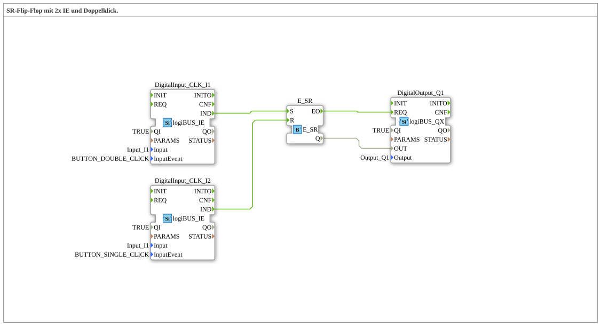

# Exercise_006d: SR Flip-Flop with 2x IE and Double-Click.

[(https://notebooklm.google.com/notebook/a6872e59-1dfc-4132-a118-aff1bc7bc944)
This article describes the logiBUS® exercise `Uebung_006d`. Here, an asymmetric operating logic for protecting the system is implemented.
----
## Objective of the Exercise

Combining complex input events (double-click) with memory blocks.

-----

## Description and Components

[cite_start]The sub-application `Uebung_006d.SUB` implements an on/off logic with different hurdles[cite: 1].

### Function Blocks (FBs)

- **`I1` (Set)**: Configured on `BUTTON_DOUBLE_CLICK`.
- **`I2` (Reset)**: Configured on `BUTTON_SINGLE_CLICK`.
- **`E_SR`**: The memory block.

-----

## Functionality

- **Activation**: Requires a deliberate action by the user (double-click on `I1`). A simple touch is not sufficient.
- **Deactivation**: Must be quick and easy when needed (single click on `I2`).

The flip-flop stores the state between these events.

-----

## Application Example

**Safety-Related Auxiliary Drives**:

A hydraulic pump or a cutting unit should not start if the switch in the cab is accidentally pressed. The user must confirm their intention by double-clicking. However, immediate shutdown in case of danger must be ensured by a single press of the off button.
