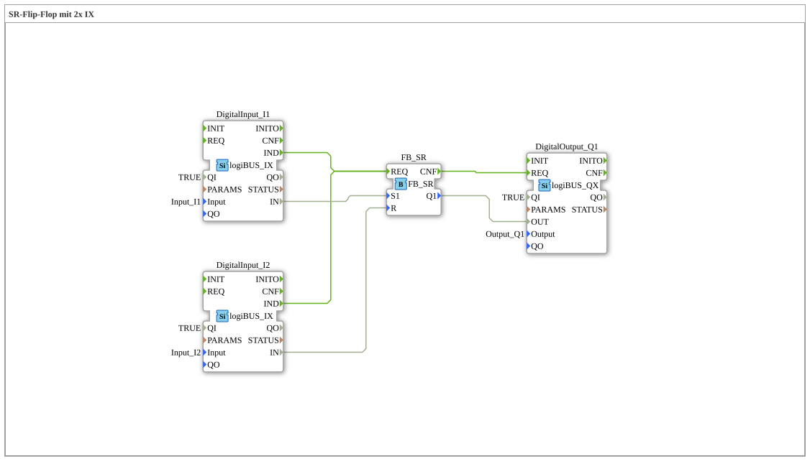

Here is the documentation page for exercise `Uebung_006e1` based on the provided data.

# Exercise_006e1: SR Flip-Flop with 2x IX



* * * * * * * * * *

## Introduction

Exercise **Exercise_006e1** demonstrates the implementation of an SR flip-flop (set-reset memory element) within a sub-application. Two digital inputs are used to control one digital output. This circuit illustrates the fundamental memory behavior in control engineering, where a pulse sets a state that is retained until reset.

## Function Blocks (FBs) Used

This exercise uses a network of standard function blocks to implement the desired logic. Since this is a `SubAppType` file, the instances it contains are described as internal function blocks.
... ### Sub-Blocks: Exercise_006e1 (Network)

* **Type**: SubAppType
* **Internal Function Blocks Used**:

* **DigitalInput_I1**: `logiBUS::io::DI::logiBUS_IX`

* Parameter: `QI` = `TRUE`

* Parameter: `Input` = `Input_I1`

* Event Output: `IND` (Indication - Signal Change)

* Data Output: `IN` (Current Input Value)

* **DigitalInput_I2**: `logiBUS::io::DI::logiBUS_IX`

* Parameter: `QI` = `TRUE`

* Parameter: `Input` = `Input_I2`

* Event output: `IND` (Indication - Signal change)

* Data output: `IN` (Current value of the input)

* **DigitalOutput_Q1**: `logiBUS::io::DQ::logiBUS_QX`

* Parameter: `QI` = `TRUE`

* Parameter: `Output` = `Output_Q1`

* Event input: `REQ` (Request - Request update)

* Data input: `OUT` (Value to be written)

* **FB_SR**: `iec61131::bistableElements::FB_SR`

* Event input: `REQ`

* Event output: `CNF`

* Data input: `S1` (Set)

* Data input: `R` (Reset)

* Data output: `Q1` (Memory state)

* **Functionality**:

The sub-app reads two hardware inputs. The first input serves as a "Set" signal, the second as a "Reset" signal for an SR memory chip. The resulting state is written to a hardware output.


* ## Program Flow and Connections

The network links the physical inputs and outputs using the logical SR function:

1. **Input Processing**:

* `DigitalInput_I1` is connected to the input `S1` (Set) of `FB_SR`.

* `DigitalInput_I2` is connected to the input `R` (Reset) of `FB_SR`.

* As soon as the value at one of the inputs changes (event `IND`), the calculation in `FB_SR` is triggered by the event `REQ`.


* 2. **Logic (SR Flip-Flop)**:

* The component `FB_SR` stores the state.

* If `S1` is TRUE, the output `Q1` is set to TRUE.

* If `R` is TRUE, the output `Q1` is set to FALSE.

* * (Note: For SR elements, the set state is usually dominant when both inputs are TRUE simultaneously. However, this depends on the specific implementation of the IEC 61131 library; typically, an SR element is reset-dominant if it is designated as SR, but the IEC standard defines SR as set-dominant. In 4diac/IEC61499, `FB_SR` is defined as follows: If S1 and R are both 1, then Q1 = 1).

3. **Output Processing**:

* The result `Q1` of the flip-flop is routed to the data input `OUT` of `DigitalOutput_Q1`.


``` * After the calculation in the flip-flop (event `CNF`) is complete, the output device is triggered (`REQ`) to update the physical output.

**Learning Objectives:**

* Understanding bistable flip-flops.

* Differentiating between setting and resetting.

* Linking event and data flows between I/O and logic devices.

## Summary

Exercise `Uebung_006e1` is a classic application of a memory function. Using two pushbuttons (or switches) at the inputs `Input_I1` and `Input_I2`, the output `Output_Q1` can be permanently turned on or off. This forms the basis for many control tasks, such as start/stop circuits for motors.

---

### 🌐 Related topic subpages on ms-muc-docs.de

* [🌐 Eclipse 4diac IDE & color reference on ms-muc-docs.de](https://www.ms-muc-docs.de/iec-61499/eclipse-4diac/)

]