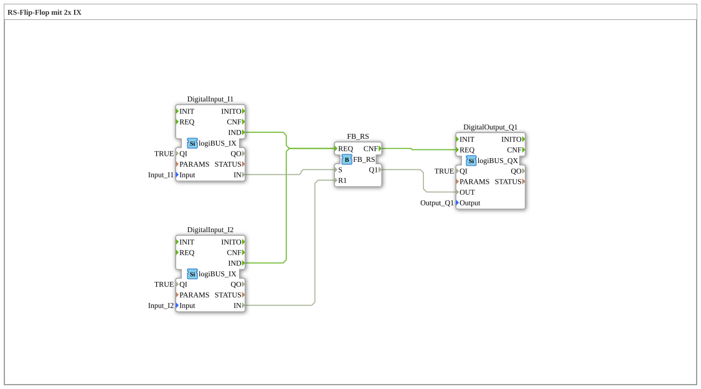

Here is the documentation for exercise `Uebung_006e2`, based on the provided data.
# Exercise_006e2: RS Flip-Flop with 2x IX

* * * * * * * * * *
## Introduction
Exercise **Exercise_006e2** demonstrates the implementation of an RS flip-flop (reset dominant) using two digital inputs (IX) and one digital output. The goal is to implement a basic memory function where one input sets the output and the other resets it. This exercise uses the `logiBUS` library for the hardware abstraction of the inputs and outputs.

## Function Blocks (FBs) Used

In this sub-application, various function blocks are instantiated and interconnected.

### Sub-Blocks: DigitalInput_I1
- **Type**: `logiBUS::io::DI::logiBUS_IX`
- **Description**: This block represents the first digital input, which functions as a "Set" signal.
- **Parameters**:
- `QI` = `TRUE` (Initialization enabled)
- `Input` = `Input_I1` (Hardware mapping to input I1)

### Sub-Blocks: DigitalInput_I2
- **Type**: `logiBUS::io::DI::logiBUS_IX`
- **Description**: This block represents the second digital input, which functions as a "Reset" signal.
- **Parameters**:
- `QI` = `TRUE`
- `Input` = `Input_I2` (Hardware mapping to input I2)

### Sub-Blocks: FB_RS
- **Type**: `iec61131::bistableElements::FB_RS`
- **Description**: A bistable element (flip-flop) with reset dominance.
- **Functionality**:
- If the input `S` (Set) is TRUE and `R1` (Reset) is FALSE, the output `Q1` becomes TRUE.
- If the input `R1` is TRUE, the output `Q1` will be FALSE (regardless of S, since RS is reset-dominant).

### Sub-Blocks: DigitalOutput_Q1
- **Type**: `logiBUS::io::DQ::logiBUS_QX`
- **Description**: This block represents the digital output that indicates the flip-flop's state.
... - **Parameters**:

- `QI` = `TRUE`
- `Output` = `Output_Q1` (Hardware mapping to output Q1)

## Program Flow and Connections

The program flow is determined by the event connections and the data connection:

1. **Input Processing**:

- The digital inputs `DigitalInput_I1` and `DigitalInput_I2` acquire signals from the hardware.
- As soon as an input value changes or is updated, a `IND` event (Indication) is triggered.

2. **Logic Processing (RS Flip-Flop)**:

- The `IND` events of both inputs are connected to the `REQ` (Request) input of `FB_RS`. This means that any change to I1 or I2 triggers the flip-flop's calculation.
- **Data Connection**:
- The value of `DigitalInput_I1` (`IN`) is connected to the Set input (`S`) of `FB_RS`.
- The value of `DigitalInput_I2` (`IN`) is connected to the reset input (`R1`) of `FB_RS`.

3. **Output Processing**:

- After the calculation of `FB_RS`, the `CNF` event (Confirmation) is triggered.
- This event is connected to the `REQ` input of `DigitalOutput_Q1` to update the output.

3. **Output Processing**:

- After the calculation of `FB_RS`, the `CNF` event (Confirmation) is triggered.
- This event is connected to the `REQ` input of `DigitalOutput_Q1` to update the output. - **Data Connection**: The result output `Q1` of the flip-flop is passed to the input `OUT` of `DigitalOutput_Q1`.

**Summary of Behavior:**
- A button/switch connected to **Input_I1** activates the output **Output_Q1**.
- A button/switch connected to **Input_I2** deactivates the output **Output_Q1**.
- If both inputs are activated simultaneously, the output remains off (reset is dominant).

## Summary
This exercise is a classic example of programmable logic controllers (PLCs) according to IEC 61131-3. It conveys an understanding of bistable elements and event-driven logic in 4diac, where the execution of logic blocks is controlled by triggers (events) from the input devices. The result is a robust circuit for switching a load on and off using two separate signals.

---

### 🌐 Related topic subpages on ms-muc-docs.de
* [🌐 Eclipse 4diac IDE & Color Reference on ms-muc-docs.de](https://www.ms-muc-docs.de/iec-61499/eclipse-4diac/)

]
