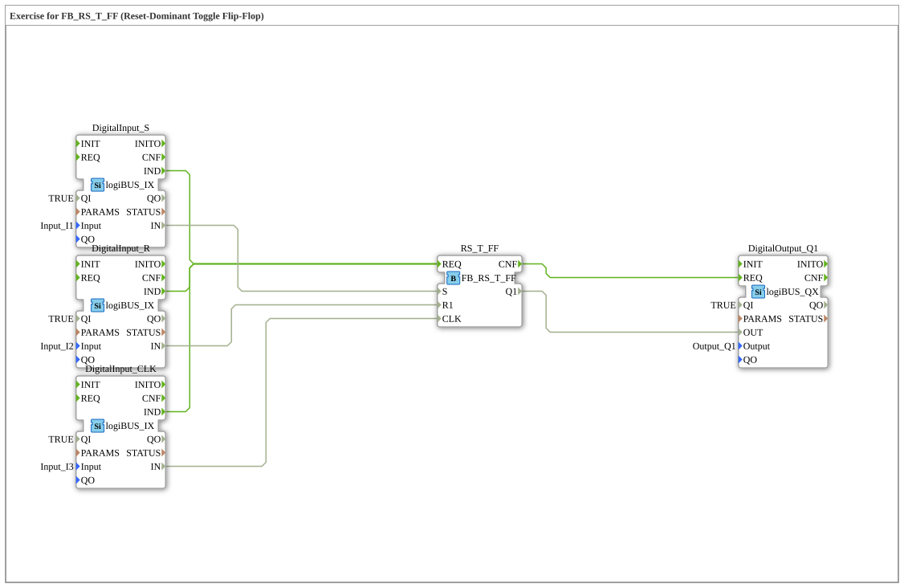

# Exercise_006f_RS: Exercise for FB_RS_T_FF (Reset-Dominant Toggle Flip-Flop)

* * * * * * * * * *
## Introduction

This exercise demonstrates the use of a **reset-dominant toggle flip-flop** (FB_RS_T_FF) in the 4diac IDE. The goal is to understand the behavior of a prioritized reset input in combination with a clock-controlled toggle mechanism. The inputs are connected via logiBUS hardware components, and the output is provided via a digital output.
## Function Blocks (FBs) Used

The exercise consists of five function blocks that are directly connected in the SubApp network:

| Block Name | Type | Purpose |
| :--- | :--- | :--- |
| `DigitalInput_S` | logiBUS::io::DI::logiBUS_IX | Digital input for the set input (S) |
| DigitalInput_R` | logiBUS::io::DI::logiBUS_IX | Digital input for the reset input (R1) |
| DigitalInput_CLK` | logiBUS::io::DI::logiBUS_IX | Digital input for the clock input (CLK) |
| RS_T_FF` | logiBUS::bistableElements::FB_RS_T_FF | Reset-dominant toggle flip-flop |
| DigitalOutput_Q1` | logiBUS::io::DQ::logiBUS_QX | Digital output for the flip-flop signal (Q1) |

### Details of the Function Blocks

#### `DigitalInput_S`, `DigitalInput_R`, `DigitalInput_CLK`

- **Type**: logiBUS::io::DI::logiBUS_IX (Hardware Input Function Block)
- **Parameters**:
- `QI` = `TRUE` (Input enabled)
- `Input` = `Input_I1`, `Input_I2`, `Input_I3` (Physical Inputs)
- **Event Output**: `IND` (Triggers when the input value changes)
- **Data Output**: `IN` (current digital value of the input)

#### `RS_T_FF`

- **Type**: logiBUS::bistableElements::FB_RS_T_FF
- **Parameters**: No user-defined parameters
- **Event Input**: `REQ` (starts processing)
- Connected to the `IND` events of all three input blocks
- **Event Output**: `CNF` (indicates completion of processing)
- **Data/Inputs**:
- `S` (Set, from `DigitalInput_S.IN`)
- `R1` (Reset, from `DigitalInput_R.IN`)
- `CLK` (Clock, from `DigitalInput_CLK.IN`)
- **Data Output**: `Q1` (Output state of the flip-flop)

#### `DigitalOutput_Q1`

- **Type**: logiBUS::io::DQ::logiBUS_QX (Hardware output module)
- **Parameters**:
- `QI` = `TRUE` (Output enabled)
- `Output` = `Output_Q1` (Physical output)
- **Event Input**: `REQ` (from the flip-flop's `CNF`)
- **Data Input**: `OUT` (from the flip-flop's `Q1`)

## Program Flow and Connections

The program flow is controlled by the physical inputs I1, I2, and I3. Any change to one of these inputs triggers the following steps:

1. **Event Triggering**: The affected input block (`DigitalInput_S`, `DigitalInput_R`, or `DigitalInput_CLK`) sends a `IND` event.
2. **Event Forwarding**: All three `IND` events are connected to the `REQ` input of the flip-flop `RS_T_FF`. Thus, the flip-flop is recalculated **every** change in any input.
3. **Data Processing in the Flip-Flop**:
- The set input `S` is fed by `DigitalInput_S.IN` (I1).
- The reset input `R1` is fed by `DigitalInput_R.IN` (I2).
- The clock input `CLK` is fed by `DigitalInput_CLK.IN` (I3).
- The flip-flop behaves in a reset-dominant manner: When `R1 = TRUE`, the output `Q1` is reset, regardless of `S` and the clock edge. When `R1 = FALSE` and a positive clock edge on `CLK`, the output is toggled when `S = TRUE`.
4. **Output**: After processing, `RS_T_FF` sends a `CNF` event to the output chip `DigitalOutput_Q1`. The new state `Q1` is then transferred to the physical output Q1.

Q1` **Important Notes**:

- By linking all three `IND` events to the same `REQ` input, the flip-flop is recalculated with every input change, even if the trigger is not a clock change. This can lead to unexpected behavior if the logic does not account for the fact that the flip-flop is actually clock-driven. In practice, the clock should be handled separately.
- This exercise is designed to help you understand the prioritization of Reset over Toggle in a reset-dominant flip-flop.

## Summary

Exercise `Uebung_006f_RS` demonstrates the integration of a reset-dominant toggle flip-flop into a 4diac application using logiBUS hardware. The three inputs (Set, Reset, Clock) are read via digital input modules. The flip-flop's output controls a digital output. The process illustrates the handling of event chains and the function of a prioritized reset. The primary learning objective is to understand the toggle logic and the dominance of the reset signal.

---

### 🌐 Related topic subpages on ms-muc-docs.de

- [🌐 Eclipse 4diac IDE & Color Reference on ms-muc-docs.de](https://www.ms-muc-docs.de/iec-61499/eclipse-4diac/)

]
