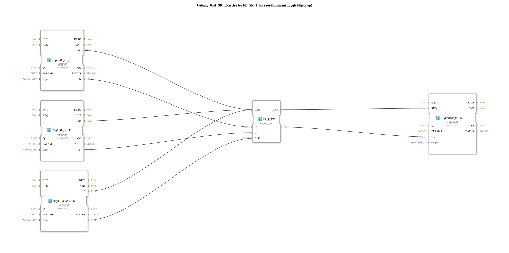

# Exercise_006f_SR: Exercise for FB_SR_T_FF (Set-Dominant Toggle Flip-Flop)

* * * * * * * * * *
## Introduction

This exercise is designed to help you understand and apply a **set-dominant toggle flip-flop** (FB_SR_T_FF). This function block combines the characteristics of an SR flip-flop with a toggle function, where the set input (S1) takes precedence over the reset input (R). The exercise demonstrates the basic interconnection of digital inputs, the flip-flop, and a digital output in the 4diac IDE using the logiBUS library.
## Function Blocks (FBs) Used

This exercise consists of five function blocks connected to each other in the logiBUS network.

- **DigitalInput_S** (Type: *logiBUS::io::DI::logiBUS_IX*)
- **Parameters**: QI = TRUE, Input = Input_I1
- **Event Output**: IND (triggered when an input signal is present)
- **Data Output**: IN (logical value of the physical input)
- **Functionality**: Reads the digital input I1 (e.g., button or sensor) and provides the value as a data signal along with the IND event.
- **DigitalInput_R** (Type: *logiBUS::io::DI::logiBUS_IX*)
- **Parameters**: QI = TRUE, Input = Input_I2
- **Event Output**: IND
- **Data Output**: IN
- **Functionality**: Reads the digital input I2 (reset button) and outputs the value along with the event.
- **DigitalInput_CLK** (Type: *logiBUS::io::DI::logiBUS_IX*)
- **Parameters**: QI = TRUE, Input = Input_I3
- **Event Output**: IND
- **Data Output**: IN
- **Functionality**: Reads the digital input I3 (clock signal) and provides the value and the event.
- **SR_T_FF** (Type: *logiBUS::bistableElements::FB_SR_T_FF*)
- **Parameters**: None (factory configuration)
- **Event Input**: REQ (triggers processing)
- **Event Output**: CNF (acknowledges execution)
- **Data Inputs**: S1 (Set, dominant), R (Reset), CLK (Clock)
- **Data Output**: Q1 (Output state)
- **Functionality**: Implements a set-dominant toggle flip-flop. At each clock edge (CLK), output Q1 is set if S1 is active, or reset if R is active. If both inputs are active, S1 (Set) takes precedence. The output toggles when neither S1 nor R is active, but only on a rising clock edge.
- **DigitalOutput_Q1** (Type: *logiBUS::io::DQ::logiBUS_QX*)
- **Parameters**: QI = TRUE, Output = Output_Q1
- **Event Input**: REQ (triggers setting the output)
- **Data Input**: OUT (value passed to the physical output)
- **Functionality**: Outputs the passed value (OUT) to digital output Q1 (e.g., LED or actuator).

## Program Flow and Connections

The following event and data connections define the exercise flow:

**Event Connections:**

- The event outputs of the three digital inputs (DigitalInput_S.IND, DigitalInput_R.IND, DigitalInput_CLK.IND) are all connected to the event input of the flip-flop (SR_T_FF.REQ).

*Note:* This means that any change to one of the inputs (S, R, or CLK) triggers the flip-flop's processing. In practice, the clock signal (CLK) should be the primary trigger; connecting all three inputs simultaneously is used here for a simplified exercise.

- The flip-flop's acknowledgment event (SR_T_FF.CNF) is connected to the event input of the output block (DigitalOutput_Q1.REQ), so that the output is updated after each flip-flop calculation.

*Note:* This means that any change to any of the inputs (S, R, or CLK) triggers the flip-flop's processing. **Data Connections:**

- DigitalInput_S.IN → SR_T_FF.S1 (Set Input)
- DigitalInput_R.IN → SR_T_FF.R (Reset Input)
- DigitalInput_CLK.IN → SR_T_FF.CLK (Clock Signal)
- SR_T_FF.Q1 → DigitalOutput_Q1.OUT (Output Value)

**Process:**

1. A signal at one of the digital inputs (I1, I2, or I3) generates an event (IND).
2. This event triggers the flip-flop (REQ).
3. The flip-flop evaluates the current data values at S1, R, and CLK and calculates the new state Q1 according to the set-dominant toggle logic.
4. After the calculation, the flip-flop signals completion (CNF).
5. The output receives the value (OUT) and sets the physical output Q1 accordingly.

**Learning Objectives:**

- Understanding the functionality of a set-dominant toggle flip-flop (SR_T_FF).
- Working with logiBUS input and output blocks.
- Linking event and data flows in the 4diac IDE.
- Practical application of the logiBUS library for hardware control.

**Difficulty Level:** Easy to medium. Basic knowledge of the 4diac IDE and working with logiBUS components is required.

**Prerequisites:** Fundamentals of binary logic and the functionality of flip-flops.

**Procedure:** The exercise can be loaded in the 4diac IDE and executed on suitable hardware (e.g., a Siemens PLC with logiBUS) or in simulation mode. Inputs I1, I2, and I3 must be physically connected to pushbuttons or signal sources. Output Q1 is connected to an LED, for example.

## Summary

Exercise *Exercise_006f_SR* demonstrates the practical application of a set-dominant toggle flip-flop (FB_SR_T_FF) in the 4diac IDE. By connecting three digital inputs, the flip-flop, and a digital output, it shows how event and data flows can be controlled. The function block behaves in a set-dominant manner: If set and reset signals are present simultaneously, the set input takes precedence. This exercise is a fundamental building block for understanding sequential logic in industrial automation.

---

### 🌐 Related topic subpages on ms-muc-docs.de

* [🌐 Eclipse 4diac IDE & Color Reference on ms-muc-docs.de](https://www.ms-muc-docs.de/iec-61499/eclipse-4diac/)

]
