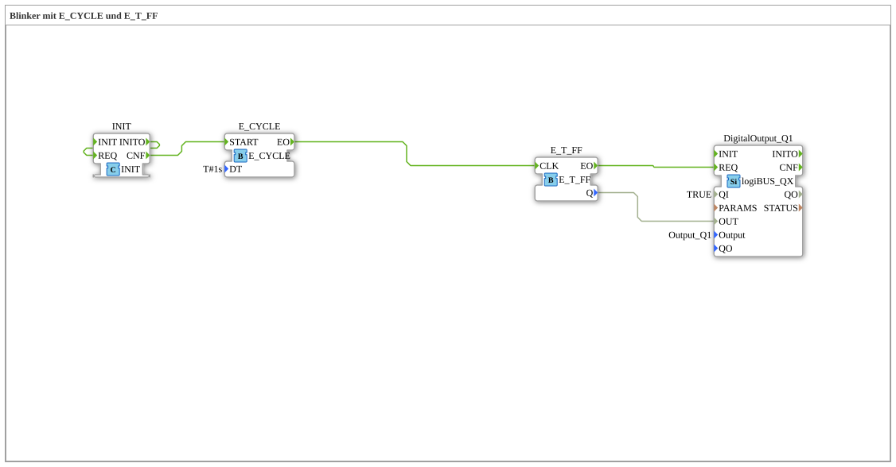

# Exercise_007: Flasher with E_CYCLE and E_T_FF

[(https://notebooklm.google.com/notebook/a6872e59-1dfc-4132-a118-aff1bc7bc944)
This article describes the logiBUS® exercise `Uebung_007`. It demonstrates how to generate periodic events to create a cyclic flashing signal
----

## Objective of the Exercise

Using the `E_CYCLE` function block to generate a time base. It demonstrates how a periodic trigger controls a toggle flip-flop to generate a smooth square wave (on/off) signal.

-----

## Description and Components

[cite_start]The subapplication `Uebung_007.SUB` combines a clock generator with a memory element[cite: 1].

### Function Blocks (FBs)

- **`E_CYCLE`**: An event generator. [cite_start]It periodically sends events at output `EO`. The parameter `DT` determines the time interval (here `T#1s` = 1 second)[cite: 1].
- **`E_T_FF`**: The toggle flip-flop, which inverts its state with each clock cycle.
- **`DigitalOutput_Q1`**: The physical lamp.

-----

## Functionality

1. The `E_CYCLE` function block fires an event every second.
2. This event reaches the `CLK` input of the `E_T_FF`.
3. The flip-flop toggles its state with each pulse (Off ➡️ On ➡️ Off ➡️ ...).
4. Since two clock pulses are required for a full cycle (On and Off), the lamp blinks at a frequency of 0.5 Hz (1 second on, 1 second off).

-----

## Application Example

**Operating Indicator**: A green LED on the control cabinet blinks slowly to indicate that the controller is active and the program is running correctly.
