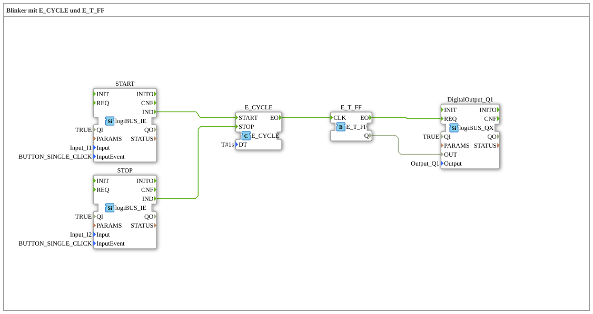

# Exercise_007a1: Flasher with E_CYCLE and E_T_FF

This article describes the logiBUS® exercise `Uebung_007a1`. Here, the exercise attempts to switch the flasher from exercise 007 on and off using external pushbuttons.
----
## Objective of the exercise

Controlling a clock generator using start and stop events.

-----

## Description and components

[cite_start]In `Uebung_007a1.SUB`, the control inputs of the `E_CYCLE` block are used[cite: 1].

### Function Blocks (FBs)

* **`START` (I1)**: Sends an event to `E_CYCLE.START`.
* **`STOP` (I2)**: Sends an event to `E_CYCLE.STOP`.
* **`E_CYCLE`**: Starts or stops the generation of clock events.

-----

## The Problem

As noted in the exercise comment: *"this blinker randomly stays ON or OFF"*.

When the `STOP` instruction arrives, `E_CYCLE` immediately stops its operation. The downstream flip-flop `E_T_FF`, however, remains in its **last** state. If the lamp was on at that moment, it will stay lit. This is usually undesirable and potentially dangerous in automation technology.

-----

## Conclusion

This exercise serves as a lesson that simply stopping a clock signal is insufficient to bring a system into a safe (off) state.