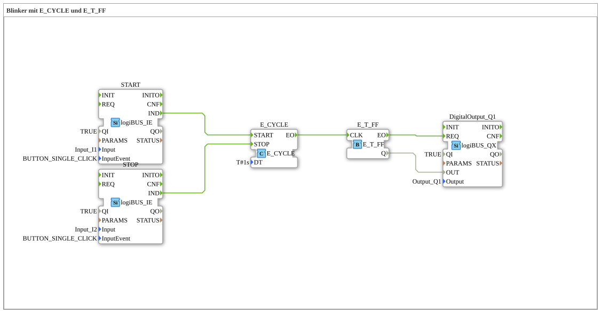

# Exercise_007a2: Turn Signal with E_CYCLE and E_T_FF

[(https://notebooklm.google.com/notebook/a6872e59-1dfc-4132-a118-aff1bc7bc944)
This article describes the logiBUS® exercise `Uebung_007a2`.
----
## Overview

[cite_start]Structurally, this exercise is identical to `Uebung_007a1` and serves to reinforce knowledge[cite: 1]. Here, too, the problem of the undefined end state when the turn signal stops exists.

[cite_start]Structurally, this exercise is identical to `Uebung_007a1` and serves to reinforce knowledge.[cite: 1] Here, too, the problem of the undefined end state when the turn signal stops exists.

[

[cite_start]